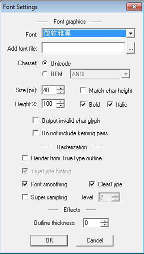
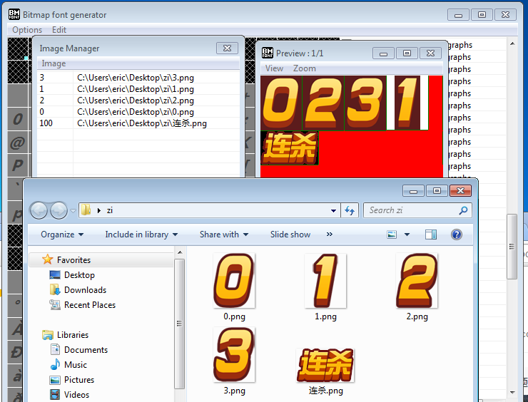
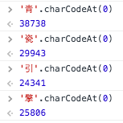
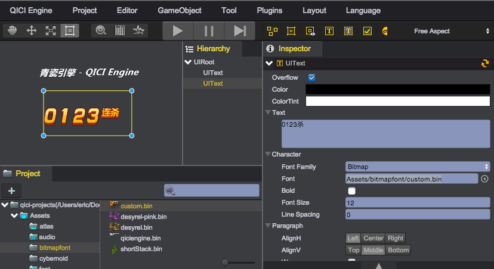

# 图片字体的制作与使用

## 软件
这里我们采用免费的[Bitmap Font Generator](http://www.angelcode.com/products/bmfont/)图片字体生成器软件，来介绍如何生成图片字体，以及在青瓷引擎编辑器中的使用。

以下为一些兼容Bitmap Font Generator格式，并在行业中广泛应用的其他图片字体生成器工具：
1. [Littera](http://kvazars.com/littera/) - 免费在线工具
2. [Glyph Designer](https://71squared.com/glyphdesigner) Mac下付费应用
3. [ShoeBox](http://renderhjs.net/shoebox/) 免费Adobe Air应用工具
4. [Hiero](https://github.com/libgdx/libgdx/wiki/Hiero) 开源Java工具

## 创建图片字体
1. 打开Bitmap Font Generator软件，选择菜单Options/Font Setting：  
	  
进行字体选择，字体大小等设置，如果采用导入图片的方式，则无需进行此操作。

2. 选择菜单Options/Export options	：  
	
进行导出图片宽高设置，File format需设置为XML格式

3. 如果采用导入图片的方式，选择菜单Edit/Open Image Manger进行文字图片选择：  
	

4. 选择菜单Edit/Select chars from file，可批量设置需要导出的字符，如果采用导入图片的方式，则每张图片导入时需要设置Id参数，该参数为字符对应编码，可按照Unicode转码器进行转换，或者通过浏览器控制台调用'Q'.charCodeAt(0)的方式得到编码：  
	  
	  

5. 选择菜单Options/Save bitmap font as...进行文件导出
导出后得到的fnt和png后缀的两个文件就是我们需要的资源

## 导入到工程
1. 将fnt后缀改成xml后缀，并保证fnt和png的文件名一致，例如：
	* file.fnt -> myFont.xml
	* file.png -> myFont.png
2. 将这两个文件拖入Project面板，例如在：Assets/bitmapfont/myFont.bin

## 设置文字图片字体
1. 将UIText的Font Family属性设置为Bitmap
2. 将Font设置为导入工程后生成的图片字体bin文件    
	  

## Demo
[BitmapFont Demo](http://engine.zuoyouxi.com/demo/UIText/font_bitmap/index.html)
