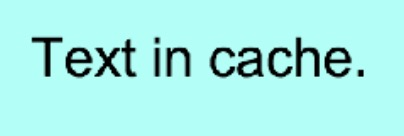

# 节点图片缓存

部分节点由很多部分组合而成，而且每个组合部分，很少变动。如果将节点缓存为一张图片，那可以减少绘制，提升性能。  
有鉴于此，提供了qc.CacheAsBitmap功能，将节点缓存为图片。
````javascript
var cacheAsBitmap = node.addScript('qc.CacheAsBitmap');
````

## 缓存的类型(Cache Type)
根据缓存的方式不同，提交两种方式：

1. __相对于自身缓存(Cache For Self)__  
以节点本身为原点，对节点及节点下的子节点进行缓存。当节点自己身旋转、缩放时，不需要更新缓存，直接显示就可用。这种模式有个缺点，就是文本内容的显示，因为不是直接对屏幕进行绘制，导致旋转、缩放后，文本在实际显示中会变模糊。
````javascript
cacheAsBitmap.cacheType = qc.CacheAsBitmap.CACHE_FOR_SELF;
````

2. __相对于屏幕缓存(Cache For Screen)__  
以屏幕坐标系为主，缓存节点及节点下的子节点在屏幕中的显示内容。当节点自身旋转、缩放时，需要更新缓存（cacheAsBitmap.dirty = true）。这种模式下，文本显示与未缓存时的显示效果一样，但不适用于节点需要旋转、缩放的场合。
````javascript
cacheAsBitmap.cacheType = qc.CacheAsBitmap.CACHE_FOR_SCREEN;
````

可以参考下面的图片，在节点自身scale为(3,3)时，比较两种效果下文本的显示区别：

|自身缓存|屏幕缓存|
|:-----:|:-----:|
|||

##缓存的范围(Bounds Type)
所有的节点可能不是全部需要显示出来，为了减少一些内存等消耗，提供了两种缓存范围：
1. __只缓存自己身范围(Only Self)__  
不考虑子节点的显示范围，如果子节点超出节点的大小，会被裁切
````javascript
cacheAsBitmap.boundsType = qc.CacheAsBitmap.BOUNDS_SELF;
````

2. __缓存所有节点范围(All Children)__  
将自身节点和所有子节点都缓存起来。
````javascript
cacheAsBitmap.boundsType = qc.CacheAsBitmap.BOUNDS_ALL;
````

*__注意:__* 文本的范围为文本节点的范围，而不是文本显示的实际范围。
效果如下：

|自身范围|所有节点范围|
|:-----:|:-----:|
|||

*__注意：__*如果缓存的范围比较大，节点在屏幕中的位置相对不变的情况下，可以选择只缓存屏幕中的范围(Bounds In Screen)。这样可以减少缓存的图片大小，减少内存消耗。
````javascript
cacheAsBitmap.boundsInScreen = true;
````
