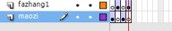
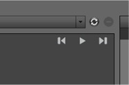
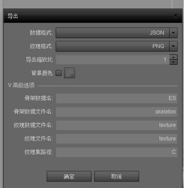
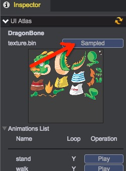

# 骨骼动画
[DragonBones](http://dragonbones.effecthub.com/download.html)是开源的2D骨骼动画解决方案，青瓷引擎支持DragonBones骨骼动画数据格式。  
你可以通过阅读[DragonBones快速入门指南](http://dragonbones.effecthub.com/getting_started_cn.html)学习如何安装以及在项目中使用DragonBones。 

## 所需软件
* [Adobe Flash Professional CS6](http://www.adobe.com/)
* 骨骼动画导出插件[DragonBones 3.0](http://dragonbones.effecthub.com/download.html)

## 制作注意事项
1. 每个图层里面的单独帧只能带一个元件，如果要复制元件，必须新建图层。  
	  
2. 每张图片最好只转换一次元件，如果同一张图片转换为2次元件，那么导出时就变成2张同样的图片
3. 同个图层里面不同帧中，如果有不同元件时，注意不要连续创建不同元件，应多建一个图层，在不同的图层进行编辑  
	  
4. 制作时，一定要在图层里进行动作帧命名  
	  
5. 文件规范与命名
	* 不要带中文
    * 一般默认3个目录：元件目录、图片目录、总元件目录  
      

## 导出骨骼动画
1. 打开插件  
	  
2. 打开后，选择导入  
  如果遇到提示：没有导入对象时，那么请注意：
  * 双击动作元件，进行尝试
  * 检查动作图层里面是否对动作进行命名了	

  导出后的面板如下图：  
    

3. 编辑导出后的动作  
	      
	* 设置混合时间为0  
	* 播放次数中1代表播放一次，0代表循环播放  
4. 动作设置完成后，在播放面板中对动作进行检查预览，确认无误  
	   
5. 选择导出按钮：  
	   
	* 数据格式选择：__JSON__
	* 纹理格式选择：__PNG__
	* 如果制作中图片觉得太大，可以去改变缩放比
6. 这样我们得到3个文件：
	* skeleton.json - 动作描述文件
	* texture.json - 图集描述文件
	* texture.png - 图集

## 导入青瓷引擎工程 - 方案1： 
1. 修改3个文件名，使其具有相同的前缀名，例如panda
    * skeleton.json -> panda.ani
    * texture.json -> panda.json
    * texture.png -> panda.png
2. 将这3个文件拖入Project工程的Assets/monster目录中，导入完成  

视频演示：  
<video controls="controls" src="../video/import_dragonbone1.mp4"></video>  

## 导入青瓷引擎工程 - 方案2： 
1. 打开资源导入面板：  
    
2. 将skeleton.json、texture.json、texture.png拖入到面板中，设置好骨骼动画名称、路径后，导入：    
    

视频演示：  
<video controls="controls" src="../video/import_dragonbone2.mp4"></video>  

## 帧采样
通过采样，可以大大提升渲染效率和降低CPU运算。采样后的骨骼动画使用方式保持一致。  
1. 选择需要做帧采样的骨骼动画
2. 点击Sampled按钮，帧采样完成  
      

视频演示：  
<video controls="controls" src="../video/sampled_dragonbone.mp4"></video>  
