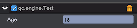
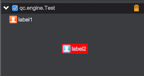
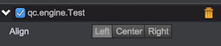
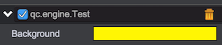

# GUI组件

*qc.editor.gui是个全局对象，后续简称为gui*

gui提供了一些便捷方法创建组件，创建好组件加入到布局单元格中即可组成用户界面。

## gui.text(text, properties, layoutConfig)
创建一个文本组件:	
* __text__: 字符串类型，表示文本内容
* __properties__: 对象类型，文本组件的其它属性(可选)
* __layoutConfig__: 对象类型，表示布局参数，可用属性如下：
	* __colspan__: 数字类型，跨列数
	* __rowspan__: 数字类型，跨行数
	* __cellPadding__: 数组或数字类型，表示单元格内边距。如果为数组，要求有四个元素，分别表示上、右、下、左四边的内边距
	* __fill__: 字符串类型，组件是否填满单元格，可用值有：
		* __'fill'__: 组件填充单元格，这是默认值
		* __'none'__: 组件不填充单元格，而是使用自己的首选大小作为要显示的尺寸，水平位置由align参数决定，垂直位置由vAlign参数决定
		* __'h'__或__'horizontal'__: 水平方向填充单元格，垂直方向的高度取组件自身首先高度和单元格高度的最小值
	* __align__: 字符串类型，当fill参数为'none'时，此参数控制组件在水平方向的对齐方式，可选值有'left'|'right'|'center'
	* __vAlign__: 字符串类型，当fill参数为'none'时，此参数控制组件在垂直方向的对齐方式，可选值有'top'|'bottom'|'middle'
	* __keepRatio__: 布尔类型，当fill参数为'none'时，如果组件的首选大小超过了单元格的宽高，显示组件时要缩小其尺寸，此参数控制缩小组件尺寸时是否保持原始比例，默认为false


返回值：文本组件对象(qc.editor.Text实例)

```javascript
// 示例：
gui.columnWidths = ['100+0.1'];
// 普通文本
gui.line([
	gui.text('Text1')
]);
// 指定了背景色和设置布局的文本
gui.line([
	gui.text('Text2', { background: '#ff0000' }, { fill: 'none', align: 'center', vAlign: 'middle' })
], 100);
```

运行效果：


文本组件上除了API文档里的属性，还有一个特殊的for属性用于与数字输入框建立关联。建立关联后，在文本组件上拖拽可快速调整数字输入框的值，看下面的示例：
```javascript
// 示例：
gui.columnWidths = ['80+0.1', '100+0.1'];
// 普通文本
gui.line([
	gui.text('Age', { for: 'age', max: 100, min: 18, step: 1 }),// for属性要与数字输入框的id保持一致
	gui.numberInput({ id: 'age' }) // 为数字输入框指定id
]);
```

运行效果：



鼠标在'Age'文本上按下并左右拖拽可快速调整数字输入框的值。在代码中可以看到，有max、min、step三个属性搭配for属性使用，它们的含义很好理解：

* max 拖拽过程中允许的最大值
* min 拖拽过程中允许的最小值
* step 拖拽步进

## gui.label(text, properties, layoutConfig)

创建一个标签组件

标签组件和文本组件比较像，它增加了对icon的支持，但是相应的也会造成额外的性能开销，使用中可根据需求和性能平衡取舍。

参数说明：

* text 字符串类型，表示文本内容
* properties 对象类型，标签组件的其它属性(可选)
* layoutConfig 对象类型，表示布局参数，参考gui.text，不再赘述

返回值：标签组件对象(qc.editor.Label实例)

```javascript
// 示例：
gui.columnWidths = ['100+0.1'];
// 普通标签
gui.line([
	gui.label('label1', { icon: 'http://bbs.zuoyouxi.com/static/image/common/online_admin.gif', iconStretch: 'uniform' })
]);
// 指定了背景色、icon和布局的标签
gui.line([
	gui.label('label2', 
	{ background: '#ff0000', icon: 'http://bbs.zuoyouxi.com/static/image/common/online_moderator.gif', iconStretch: 'uniform' }, 
	{ fill: 'none', align: 'center', vAlign: 'middle' })
], 100);
```

运行效果：



标签组件也支持for、max、min、step属性，用法与文本组件一样

## gui.divider(properties, layoutConfig)

创建一条分割线

参数说明：

* properties 对象类型，分割线的属性配置(可选)
* layoutConfig 对象类型，表示布局参数，参考gui.text，不再赘述

返回值：分割线组件对象(qc.editor.Divider实例)

```javascript
// 示例：
gui.columnWidths = ['60+0.1', '60+0.1', '60+0.1'];
gui.line([
	gui.divider(),
	gui.text('normal text', { align: 'center' }),
	gui.divider({ color: 'red' })
]);
gui.line([
	gui.divider(null, {colspan: 3})
]);
```

运行效果：


## gui.empty(layoutConfig)

创建空白组件

有时候会需要将布局中的某一个或几个(跨行、跨列)单元格留空，这种需求可以使用此组件

参数说明：

* layoutConfig 对象类型，表示布局参数，参考gui.text，不再赘述

返回值：空白组件

```javascript
// 示例：
gui.columnWidths = ['60+0.1', '60+0.1', '60+0.1'];
gui.line([
	gui.empty({ colspan: 2 }), // 第一列和第二列留空
	gui.text('normal text')
]);
```

## gui.button(text, properties, layoutConfig)

创建按钮组件

参数说明：

* text 字符串类型，表示按钮文本
* properties 对象类型，配置按钮组件的其它属性(可选)
* layoutConfig 对象类型，表示布局参数，参考gui.text，不再赘述

返回值：按钮组件对象(qc.editor.Button实例)

```javascript
// 示例：
gui.columnWidths = ['100+0.1'];
var button;
gui.line([
	button = gui.button('button')
]);
// 注册点击事件
button.on('click', function(e) {
	alert('click on button')
});
```

运行效果：


## gui.buttonGroup(items, properties, layoutConfig)

创建按钮组

参数说明：

* items 数组类型，数组里每个元素都是一个JavaScript对象用来表示一个按钮
* properties 对象类型，配置按钮组的其它属性(可选)
* layoutConfig 对象类型，表示布局参数，参考gui.text，不再赘述

返回值：按钮组对象(qc.editor.ButtonGroup实例)

```javascript
// 示例：
gui.columnWidths = ['60+0.1', '100+0.1'];
gui.line([
	gui.text('Align'),
	gui.buttonGroup([
        {
            text: 'Left',
            value: 'Left'
        },
        {
            text: 'Center',
            value: 'Center'
        },
        {
            text: 'Right',
            value: 'Right'
        }
    ], { bind: 'align' })// 绑定属性
]);
```

运行效果：



bind属性需要特别注意，这是一个很有用的属性，可以将组件和我们的面板Target(一般来说是我们的Behavior对象)的某个属性双向绑定，
绑定以后组件值和属性即可自动互相同步。所有的输入组件如numberInput、stringInput等都可以进行绑定

## gui.stringInput(properties, layoutConfig)

创建文本输入框

参数说明：

* properties 对象类型，文本输入框的属性配置(可选)
* layoutConfig 对象类型，表示布局参数，参考gui.text，不再赘述

返回值：文本输入框对象(qc.editor.StringInput)

```javascript
// 示例：
gui.columnWidths = ['60+0.1', '100+0.1'];
var input;
gui.line([
	gui.text('Name'),
	input = gui.stringInput({ value: 'initial value' })// value指定了默认值
]);
// 值变化回调函数
input.onValueChanged = function(newValue) {
	alert(newValue);
};
```

运行效果：


此组件支持bind属性

## gui.textArea(properties, layoutConfig)

创建文本域组件

参数说明：

* properties 对象类型，文本域的属性配置(可选)
* layoutConfig 对象类型，表示布局参数，参考gui.text，不再赘述

返回值：文本输入框对象(qc.editor.TextArea)

```javascript
// 示例：
gui.columnWidths = ['60+0.1', '100+0.1'];
var textArea;
gui.line([
	gui.text('Description'),
	textArea = gui.textArea({ value: 'line1\nline2\nline3' })// value指定了默认值
], 100);
// 值变化回调函数
textArea.onValueChanged = function(newValue) {
	alert(newValue);
};
```

运行效果：


此组件支持bind属性

## gui.numberInput(properties, layoutConfig)

创建数字输入框

参数说明：

* properties 对象类型，数字输入框的属性配置(可选)
* layoutConfig 对象类型，表示布局参数，参考gui.text，不再赘述

返回值：数字输入框对象(qc.editor.NumberInput)

```javascript
// 示例：
gui.columnWidths = ['60+0.1', '100+0.1'];
var input;
gui.line([
	gui.text('Age'),
	// value 指定默认值
	// min 指定最小值
	// max 指定最大值
	// precision 指定精度，即保留多少位小数
	input = gui.numberInput({ value: 3.14, min: 0, max: 100, precision: 5 })
]);
// 值变化回调函数
input.onValueChanged = function(newValue) {
	alert(newValue);
};
```

运行效果：


此组件支持bind属性

## gui.intInput(properties, layoutConfig)

创建整数输入框

此组件是qc.editor.Number的子类，限制用户只能输入整数

参数说明：

* properties 对象类型，数字输入框的属性配置(可选)
* layoutConfig 对象类型，表示布局参数，参考gui.text，不再赘述

返回值：数字输入框对象(qc.editor.IntInput)

```javascript
// 示例：
gui.columnWidths = ['60+0.1', '100+0.1'];
var input;
gui.line([
	gui.text('Age'),
	input = gui.intInput({ value: 3 })// value指定了默认值
]);
// 值变化回调函数
input.onValueChanged = function(newValue) {
	alert(newValue);
};
```

运行效果：


此组件支持bind属性

## gui.angleInput(properties, layoutConfig)

创建角度输入框

对于角度类型的属性，一般属性上存弧度制数字，但用户编辑时习惯用角度制编辑。此组件可处理这种需求，即：
展现和编辑时使用角度制，存储时使用弧度制

参数说明：

* properties 对象类型，角度输入框的属性配置(可选)
* layoutConfig 对象类型，表示布局参数，参考gui.text，不再赘述

返回值：角度输入框对象(qc.editor.AngleInput)

```javascript
// 示例：
gui.columnWidths = ['60+0.1', '100+0.1'];
var angleInput;
gui.line([
	gui.text('Angle'),
	angleInput = gui.angleInput({ bind: 'angle' })
]);
// 值变化回调函数
angleInput.onValueChanged = function(newValue) {
	console.log(angleInput.toGameValue());// 转为弧度
};
```

运行效果：


此组件支持bind属性

## gui.sliderInput(properties, layoutConfig)

创建拉条输入框

此组件由拉条和数字输入框组成

参数说明：

* properties 对象类型，拉条输入框的属性配置(可选)
* layoutConfig 对象类型，表示布局参数，参考gui.text，不再赘述

返回值：拉条输入框对象(qc.editor.SliderInput)

```javascript
// 示例：
gui.columnWidths = ['60+0.1', '100+0.1'];
var sliderInput;
gui.line([
	gui.text('Angle'),
	sliderInput = gui.sliderInput()
]);
// 值变化回调函数
sliderInput.onValueChanged = function(newValue) {
	alert(newValue);
};
```

运行效果：


此组件支持bind属性

## gui.checkBox(properties, layoutConfig)

创建复选框组件

参数说明：

* properties 对象类型，复选框的属性配置(可选)
* layoutConfig 对象类型，表示布局参数，参考gui.text，不再赘述

返回值：复选框对象(qc.editor.CheckBox)

```javascript
// 示例：
gui.columnWidths = ['60+0.1', '100+0.1'];
var checkBox;
gui.line([
	gui.text('checkBox'),
	checkBox = gui.checkBox({ selected: true })// 设置其选中
]);
// 值变化回调函数
checkBox.onValueChanged = function(newValue) {
	alert(newValue);
};
```

运行效果：


此组件支持bind属性

## gui.dropDownList(properties, layoutConfig)

创建下拉框

参数说明：

* properties 对象类型，下拉框的属性配置(可选)
* layoutConfig 对象类型，表示布局参数，参考gui.text，不再赘述

返回值：下拉框对象(qc.editor.DropDownList)

```javascript
// 示例：
gui.columnWidths = ['60+0.1', '100+0.1'];
var dropDownList;
gui.line([
	gui.text('Birthday'),
	dropDownList = gui.dropDownList({ 
		// items指定列表项
		items: ['1988', '1989', '1990', '1991', '1992', '1993', '1994', '1995'],
		// value指定默认值
		value: '1988'
	})
]);
// 值变化回调函数
dropDownList.onValueChanged = function(newValue) {
	alert(newValue);
};

// 下面演示了对象格式的item
gui.line([
	gui.text('Language'),
	gui.dropDownList({ 
		items: [
			{ label: 'C', value: 0 }, 
			{ label: 'C++', value: 1 },
			{ label: 'Java', value: 2 },
			{ label: 'JavaScript', value: 3}
		],
		value: 1
	})
]);
```

运行效果：


此组件支持bind属性

## gui.multiDropDownList(properties, layoutConfig)

创建多选下拉框

多选下拉框是qc.editor.DropDownList的子类，支持多选

参数说明：

* properties 对象类型，多选下拉框的属性配置(可选)
* layoutConfig 对象类型，表示布局参数，参考gui.text，不再赘述

返回值：多选下拉框对象(qc.editor.MultiDropDownList)

```javascript
// 示例：
gui.columnWidths = ['60+0.1', '100+0.1'];

gui.line([
	gui.text('Language'),
	gui.multiDropDownList({ 
		items: [
			{ label: 'C', value: 0 }, 
			{ label: 'C++', value: 1 },
			{ label: 'Java', value: 2 },
			{ label: 'JavaScript', value: 3}
		],
		value: [1, 2]
	})
]);
```

运行效果：


此组件支持bind属性

## gui.colorPicker(properties, layoutConfig)

创建颜色选择器

参数说明：

* properties 对象类型，颜色选择器的属性配置(可选)
* layoutConfig 对象类型，表示布局参数，参考gui.text，不再赘述

返回值：颜色选择器对象(qc.editor.ColorPicker)

```javascript
// 示例：
gui.columnWidths = ['60+0.1', '100+0.1'];
var colorPicker;

gui.line([
	gui.text('Background'),
	colorPicker = gui.colorPicker()
]);

colorPicker.onValueChanged = function(newValue) {
	alert(newValue);
};
```

运行效果：



点击颜色区域即可弹出颜色设置界面，如下图：


此组件支持bind属性

## gui.objectInput(properties, layoutConfig)

创建对象输入框，该组件必须使用绑定模式，即需要设置bind信息。

对象输入框可显示texture资源、声音资源、字体资源及场景中的游戏对象等。

参数说明：

* properties 对象类型，对象输入框的属性配置。必填属性列举如下：
	* objectType: 组件接受何种类型的对象
		* 'prefab': 预置对象
		* 'texture': 图片资源
		* 'sound': 声音资源
		* 'font': 字体资源
		* 'textAsset': 文本资源
		* 'excelAsset': Excel资源
		* 'bitmapFont': bitmapFont资源
		* 'node': 游戏场景中的对象
	* target: 要绑定的target
	* bind: 要绑定的属性
* layoutConfig 对象类型，表示布局参数，参考gui.text，不再赘述

返回值：对象输入框对象(qc.editor.ObjectInput)

```javascript
// 示例：
gui.columnWidths = ['60+0.1', '100+0.1'];

gui.line([
	gui.text('Node'),
	gui.objectInput({objectType: 'node', target: {}, bind: 'node'})
]);
```

运行效果：


