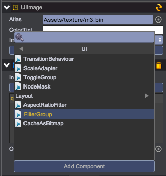
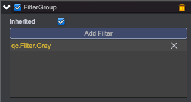

# 着色器
__注意：着色器(Filter)只在支持WebGL的浏览器上有效果，在Canvas渲染模式下着色器的效果不起效。__

## 使用着色器

1. 添加 UI/FilterGroup 组件到UIImage节点  
 

2. 通过“Add Filter”按钮可以添加各着色器，一个UIImage可以有多个Filter来混合出各种组合效果。    
 

## 着色器类型

目前提供的内置着色器支持如下效果：
    
1. __qc.Filter.AlphaMask__   
      
      
Other Texture: 采用另一张图片的透明度信息混合原始图片

2. __qc.Filter.Highlight__  
          
     
Light: 0~1，高亮因素     
Light Color: 高亮颜色   
      
3. __qc.Filter.BlurX__  
          
       
Blur: 水平模糊因素    
    
4. __qc.Filter.BlurY__   
          
       
Blur: 垂直模糊因素    
    
5. __qc.Filter.Gray__   
             
       

6. __qc.Filter.BlendTexture__   
             
       
Other Texture: 采用另一张图片的透明度信息混合原始图片    
Mix: 0~1，混合因素   
 
7. __qc.Filter.KeepSource__     
                    
       

## Demo
[Filter Demo](http://engine.zuoyouxi.com/demo/Filter/filter_mixed/index.html)     
