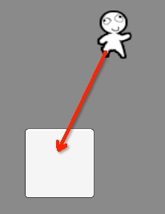

# 输入与交互

## Node的输入事件捕获与处理
这里我们通过一个例子来了解如何捕获鼠标（或触摸）事件并做相应的处理。

### 方法1：函数重载
1. 创建1个UIImage控件节点，并设置好图片、位置等信息
2. 节点勾选Interactive属性，这样节点就有能力捕获输入事件了  
  
3. 新增事件处理组件脚本InputTest.js，并将此组件挂载到UIImage节点 

````javascript
var InputTest = qc.defineBehaviour('qc.demo.InputTest', qc.Behaviour,
    function() {
    },
    {
		// 需要序列化的属性
    }
);

// 处理鼠标（或触摸）按下事件
InputTest.prototype.onDown = function(e) {
    console.log('onDown', e);

    // 如果这里返回true，那么事件派发就由此截止，不再派发到其他脚本函数上
    // return true;
};

// 处理鼠标（或触摸）抬起事件
InputTest.prototype.onUp = function(e) {
    console.log('onUp', e);

    // 如果这里返回true，那么事件派发就由此截止，不再派发到其他脚本函数上
    // return true;
};

// 处理鼠标（或触摸）点击事件
InputTest.prototype.onClick = function(e) {
    console.log('onClick', e);

    // 如果这里返回true，那么事件派发就由此截止，不再派发到其他脚本函数上
    // return true;
};
````
  
运行之，并点击（或触摸）图片，查看控制台打印
  * 节点被点击时，会触发3个事件：onDown、onClick、onUp
  * 只要在被点击的节点挂载脚本，脚本中实现了这3个函数，那么系统会自动调度，不需要做其他事件的绑定处理

### 方法2：添加事件监听
1. 修改上述的InputTest脚本： 

````javascript
var InputTest = qc.defineBehaviour('qc.demo.InputTest', qc.Behaviour, function() {
},
{
    // 需要序列化的字段
});

// 初始化时处理绑定输入事件处理
InputTest.prototype.awake = function() {
    var self = this,
        o = this.gameObject;

    // 注册事件的监听
    self.addListener(o.onDown, self._onDown, self);
    self.addListener(o.onClick, self._onClick, self);
    self.addListener(o.onUp, self._onUp, self);
};

// 鼠标按下的事件处理
InputTest.prototype._onDown = function(node, pointerEvent) {
    console.log('onDown', node, pointerEvent);
};

// 鼠标松开的事件处理
InputTest.prototype._onUp = function(node, pointerEvent) {
    console.log('onUp', node, pointerEvent);
};

// 鼠标一次点击的处理
InputTest.prototype._onClick = function(node, pointerEvent) {
    console.log('onClick', node, pointerEvent);
};
````
  
运行并测试，其效果和第一个方法是一样的。

## 拖拽的处理
这里演示将一个图片拖入到某个固定位置的处理，如下图：  

1. 如上示意图，创建2个UIImage节点，并设置好图片和位置等
2. 两个节点都勾选Interactive，确保具备交互能力
3. 待拖动的节点挂载脚本组件DragTest.js：  
````javascript
    var DragTest = qc.defineBehaviour('qc.demo.DragTest', qc.Behaviour, function() {
    }, {
        // 需要序列化的字段
    });
    
    // 节点拖拽开始的处理
    DragTest.prototype.onDragStart = function(e) {
        console.log('Start Drag', e);
    
        // 记录当前的坐标位置，并标记拖拽开始
        this.oldPos = new qc.Point(this.gameObject.x, this.gameObject.y);
        this.drag = true;
        this.drop = false;
    };
    
    // 节点拖拽中的处理
    DragTest.prototype.onDrag = function(e) {
        console.log('Dragging');
    
        if (this.drag) {
            // 改变节点的目标位置
            var p = this.gameObject.getWorldPosition();
            p.x += e.source.deltaX;
            p.y += e.source.deltaY;
            p = this.gameObject.parent.toLocal(p);
            this.gameObject.x = p.x;
            this.gameObject.y = p.y;
        }
    };
    
    // 节点拖拽结束的处理
    DragTest.prototype.onDragEnd = function(e) {
        console.log('End Drag', e);
    
        // 拖拽结束了
        this.drag = false;
    
        if (!this.drop) {
            // 没有任何容器接受，反弹回去
            console.log('reset position.');
            this.gameObject.x = this.oldPos.x;
            this.gameObject.y = this.oldPos.y;
        }
    };
````
4. 目标容器（可以接收节点放下来）挂载脚本组件DropTest.js：
````javascript
    var DropTest = qc.defineBehaviour('qc.demo.DropTest', qc.Behaviour, function() {
    }, {
        // 需要序列化的字段
    });
    
    // 检查拖拽的节点是否可以放进来
    DropTest.prototype.isAllowDrop = function(node) {
        // 50%的概率可以放进来
        var r = this.game.math.random(0, 1) === 0;
        console.log(r ? 'Can Drop.' : 'Cannot Drop.');
        return r;
    };
    
    // 节点拖拽放下了
    DropTest.prototype.onDragDrop = function(e) {
        console.log('***Drop Drag', e);
    
        // 将此节点放进来
        var node = e.dragging;
        node.parent = this.gameObject;
        node.x = 0;
        node.y = 0;
    
        // 设置放置标志
        node.getScript('qc.demo.DragTest').drop = true;
    };
````
5. 运行查看效果，如果不是拖动到目标容器图片被反弹回去；否则将放入目标容器的节点下。  
说明：
* 拖拽时，在拖拽节点上需要关注onDragStart、onDrag和onDragEnd事件，以处理节点的移动
* 如果拖拽有目标容器，那么在目标节点上需要关注onDragDrop事件，处理拖拽对象放入的逻辑
* 有时我们需要实现对象满足一些特定条件才能放入本容器，此时可以实现isAllowDrop函数，系统会自动调用检测。例子中我们简单起见，50%的概率可以放入
* 流程：DragTest.onDragStart -> DragTest.onDrag -> DropTest.isAllowDrop -> DropTest.onDragDrop -> DragTest.onDragEnd

## 全局事件捕获与处理
全局捕获鼠标和键盘事件，请使用game.input模块相关接口进行事件关注，具体请点击：[Input API](http://docs.zuoyouxi.com/api/input/Input.html)

## Demo
* [DragAndDrop Demo](http://engine.zuoyouxi.com/demo/Input/input_dragAndDrop/index.html)
* [Input Demo](http://engine.zuoyouxi.com/demo/index.html#anchor_Input)
