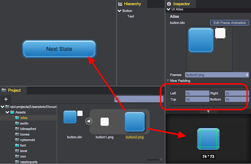

# 九宫格
1. 在Project面板中，选择要编辑的图片。如果图片在图集中，注意应该选择的是图集展开的子图片，而不是原始图片。
2. 在Inspector面板中，设置Left、Right、Top和Bottom的九宫格间距  
  

视频演示：  
<video controls="controls"  src="../video/set_nine_patch.mp4"></video>  
