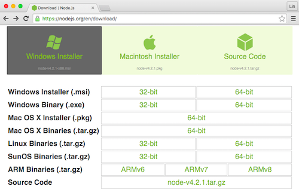

# Windows下安装

## 安装[Node.js](https://nodejs.org)环境
  [下载安装包](https://nodejs.org)，并根据提示进行安装      
      
  如果您本机已经安装了Node.js，推荐您升级到最新版本，青瓷引擎支持的Node.js版本：
  1. Node.js合并[io.js](https://iojs.org)之前任何 v0.12.x 的版本
  2. Node.js合并[io.js](https://iojs.org)之后任何高于 v4.1 的版本  

## 下载青瓷引擎
  通过[青瓷引擎官网](http://bbs.zuoyouxi.com/forum.php?mod=viewthread&tid=86)下载免安装包，并解压  

## 运行青瓷引擎 
  双击start-win.bat运行，青瓷引擎编辑器将自动在浏览器中打开：  
    
    

  * 也可在解压目录下，通过命令行启动 node ./editorservice/StartService.js
  * 青瓷引擎编辑器可运行在任何支持HTML5的浏览器，但建议采用Google Chrome浏览器运行性能最佳
  * 浏览器的访问地址为：http://localhost:port/project.html  其中port端口值见控制台（默认都为5002）：  
      
  