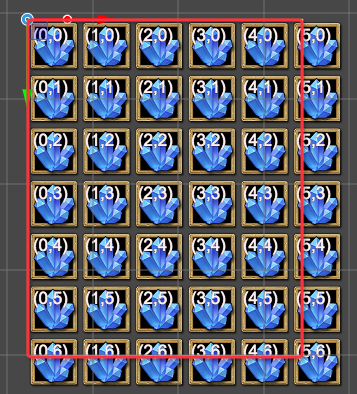
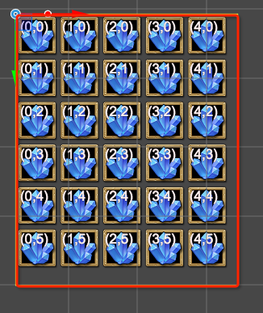

# 表格视图

## 描述
使用表格来表现的数据集合时，如果数据集合比较大，使用传统的方式，将全部的节点都创建出来，内存开销等都比较大，甚至还有无限数据的展示需求。所以我们将表格的表现和数据分开。  

使用本类来显示表格时，只会创建在可显示区域的表格，当内容移动时，回收显示区域之外的单元格，将其作为新进入显示区域的单元格进行显示。

## 变量
|  变量名  | 类型 | 作用 |
|---------|------|-----|
| adapterNode | qc.Node |  表格适配器([TableViewAdapter](TableViewAdapter.md))所在的节点。 |
| content | qc.Node | 用来挂载单元格显示的父节点，本节点下不能挂载子节点，重构表格时会删除所有的子节点。 |
| cellPrefab | qc.Prebab | 单元格的预制。 |
| overflow | boolean | 是否溢出显示，当溢出显示时，单元格完全超出显示范围才隐藏。否则只要有一边超出范围就隐藏。|
| extraLeft | number | 显示范围的左边缘距离当前节点范围左边缘的距离 |
| extraRight | number | 显示范围的右边缘距离当前节点范围右边缘的距离 |
| extraTop | number | 显示范围的上边缘距离当前节点范围上边缘的距离 |
| extraBottom | number | 显示范围的下边缘距离当前节点范围下边缘的距离 |
| canHorizontal | bool | 是否响应水平滑动 |
| canVertical | bool | 是否响应垂直滑动 |
| movementType | number | 边界限制类型，ScrollView.MOVEMENT_UNRESTRICTED（滚动区域无限制）、ScrollView.MOVEMENT_ELASTIC（滚动区域有限制，但可以超越边界，之后被拖回）、ScrollView.MOVEMENT_CLAMPED（滚动区域有限制，无法超过边界） |
| elasticity | number | 当 moveMentType 为 MOVEMENT_ELASTIC 时生效，用于表示复位速度 |
| inertia | bool | 是否惯性滑动 |
| decelerationRate | number | 惯性滑动的减速参数 |
| scrollSensitivity | number | 响应滚动时的倍率 |
| propagationScroll | bool | 是否向上传递滚动事件 |
| horizontalScrollBar | qc.ScrollBar or null | 水平滚动条，该 ScrollBar 的滑动会影响 ScrollView 的水平值，反之亦然 |
| horizontalNormalizedPosition | number | 水平方向滚动的比例（0 - 1） |
| verticalScrollBar | qc.ScrollBar or null | 垂直滚动条，该 ScrollBar 的滑动会影响 ScrollView 的纵向值，反之亦然 |
| verticalNormalizedPosition | number | 垂直方向滚动的比例（0 - 1） |

## 方法
| 原型 | 作用 |
| ------------- |-------------|
| void revokeAllCell() | 回收所有节点，该方法不会释放单元格资源，只是回收回单元格对象池中，以备下次使用。 |
| void relayout() | 重新布局。 |

##  使用方式 
* 先创建一个表格适配器[TableViewAdapter](TableViewAdapter.md)，来提供数据。
* 创建一个节点tableView，并在之下创建一个子节点content。
* 创建一个单元格预制cell。
* 将适配器和本脚本都添加到tableView节点上。
* 将content设置到本脚本的content属性上，将cell设置到本脚本的Cell Prefab属性上。将tableView设置到本脚本的Adapter Node上。
如图：

## 溢出显示与不溢出显示的区别
下面的表格演示溢出和不溢出的区别。图中，红框表示可显示区域。

| 溢出显示 | 不溢出显示 |
|:--------:|:--------:|
|  |  |

## Demo
[TableView Demo](http://engine.zuoyouxi.com/demo/Plugin/TableView/index.html)
