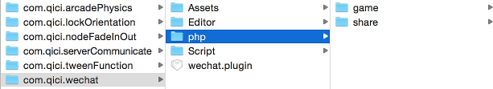

# 微信接口

本插件对微信JS-SDK进行了进一步的封装，并提供了服务器后台部分的支持，借助本插件，开发者可以方便的实现微信登录、微信分享、扫一扫、微信支付等功能。

## 开启插件
微信接口目前已经作为一个内置插件集成在了青瓷引擎编辑器中，通过菜单 Plugins->PluginManager 打开插件管理面板，并勾选 Wechat API 即可。
  
 

## 使用插件

### 服务器后台
微信接口插件的服务器后台部分位于 Plugins/com.qici.wechat/php 目录下  
  
其中，game子目录为游戏服务器部分，提供了微信登录以及登录成功后的业务逻辑处理等支持。share子目录为公众号后台部分。（share部分代码可以服务于多个公众号和多个游戏）

注意：部署前需要修改game/config.php和share/include/app_info.php，根据实际情况配置AppID、AppSecret等信息。

### 客户端部分
在场景中某个节点（通常是根节点）中挂接WeChat组件，并设置相关参数    
  

#### ShareAppId
用于分享的微信公众号的唯一标志

#### WxAppId
用于登录的微信公众号的唯一标志，通常情况下可以与ShareAppId配置相同

#### WebAppId
web应用的appId

#### Domain
存放公众号后台相关php文件的域名地址，注意：domain必须和公众号后台中配置的域名一致

#### GameDomain
游戏服务器相关php文件的域名地址

#### ExtendParams
微信登录时的扩展参数，可用于传递一些自定义信息。

#### RedirectCurrentUrl
是否使用游戏页面做为授权成功后的重定向地址。  
如果设置为true，将使用游戏页直接接收授权成功后的code。当在微信公众号后台配置了游戏域名（gameDomain）为回调地址时采用。  
如果设置为false, 将使用 this.domain + 'code.php'作为接收code的回调页，之后再跳转到本页面。当微信公众号后台配置的是domain时采用。这种情况下，游戏的域名和公众号后台配置的可以是不一样的，并且多个游戏可以共用一个公众号的信息，缺点是会进行两次跳转。

## 使用范例
````javascript

    var wx = this.getScript('qc.WeChat').wx;

    // 微信登录
    self.addListener(self.loginBtn.onClick, function() {
		wechat.login();
	});

	// 微信分享
	self.addListener(self.shareBtn.onClick, function() {
		wx.share('青瓷引擎', 'http://www.qiciengine.com/Public/Front/images/logo.png',
				'HTML5专业游戏引擎', 'http://www.qiciengine.com', function() {
	});

	// 录音
	self.addListener(self.recordBtn.onDown, function() {
		wx.startRecord();
	}); 

	// 扫一扫
	self.addListener(self.scanBtn.onClick, function() {
		wx.scanQRCode(function(r) {
		});
	});
	
````
服务器后台路径配置范例  
  

## API
[Wechat API](http://docs.zuoyouxi.com/api/officialplugins/wechat/WeChat.html)

## Demo
[Wechat Demo](http://engine.zuoyouxi.com/demo/Plugin/wechat/index.html)