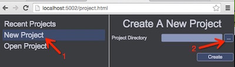

# 工程管理

## 创建新工程
1. 点击“New Project”：  
    
2. 浏览到工程目录，双击选中（__注意：目标目录必须为空目录__）    
    
3. 点击创建按钮，完成工程的创建   
    

<video controls="controls" src="../video/create_project.mp4"></video>  

## 打开工程
1. 点击“Open Project"
2. 浏览到工程所在的目录，点击“打开”按钮  
    

视频演示：  
<video controls="controls" src="../video/open_project.mp4"></video>  

__注意：如果要同时打开多个不同工程，请启动多个后台服务__  

## 切换工程
在当前工程中，选择菜单（打开最近工程，或者打开指定目录工程）：  
    
 
视频演示：   
<video controls="controls" src="../video/switch_project.mp4"></video>   
  