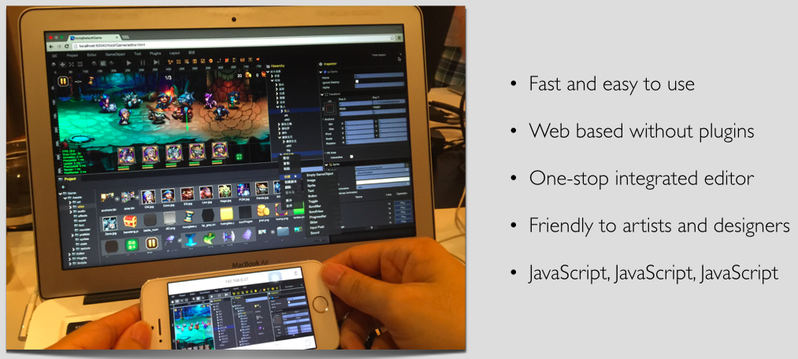
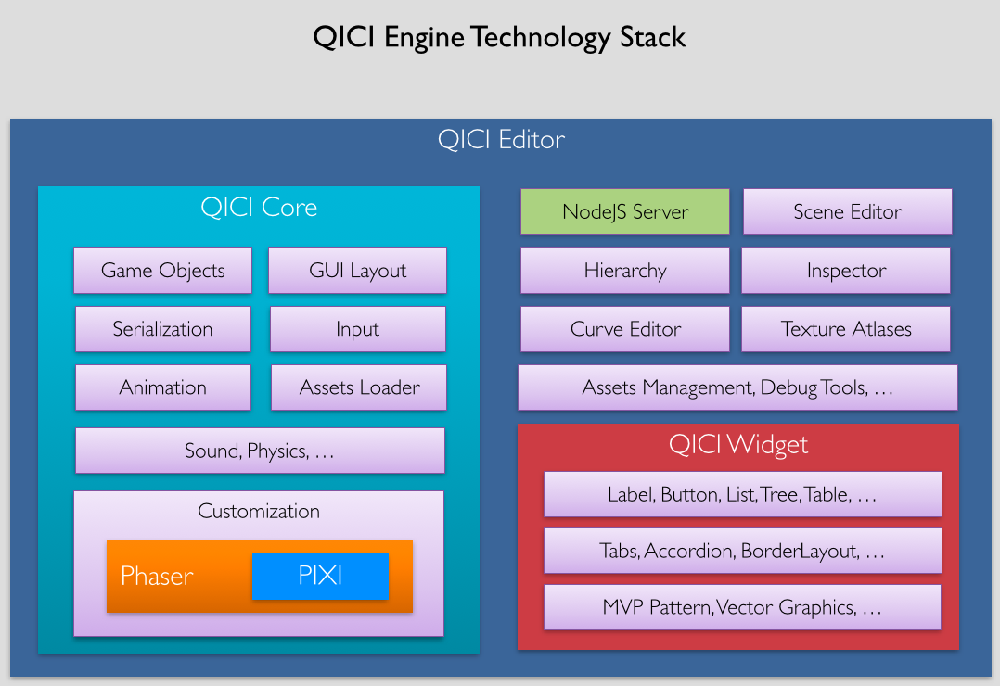

# 介绍

## 关于青瓷引擎

[青瓷引擎](http://www.zuoyouxi.com/)是一套开源免费的JavaScript游戏引擎类库，其基于开源免费的[Phaser](http://phaser.io/)游戏引擎，并提供了一套完全基于浏览器的跨平台集成式HTML5游戏编辑器。

采用青瓷引擎，开发HTML5游戏和传统Web网页开发一样，使用任何你喜欢的编辑器，使用任何你喜欢的浏览器，利用JavaScript语言和所有先进的Web开发工具，让青瓷引擎处理底层技术的复杂性，你只需要关注最重要的事情：做游戏！

## 青瓷引擎技术堆栈

青瓷引擎由三部分组成：QICI Core、QICI Widget和QICI Editor

1. QICI Core：一套JavaScript游戏引擎类库(qc-core.js)，基于开源免费的[Phaser](http://phaser.io/)游戏引擎。
2. QICI Widget：一套JavaScript图形组件库(qc-widget.js)，为编辑器提供丰富强大的通用组件。
3. QICI Editor：一套基于浏览器的跨平台集成式游戏编辑器，包含基于[Node.JS](http://nodejs.org/)的后台服务。
  
      

QICI Core可用于编程方式开发HTML5游戏，无需QICI Editor的支持。但对于界面布局稍微有点复杂度的游戏，如果没有QICI Editor这样所见即所得的可视化开发工具，很难进行快速开发和维护，采用QICI Editor美术和策划甚至都可以参与帮助游戏界面的构建。QICI Widget主要内部使用，为QICI Editor提供基础通用组件支持。

QICI Core是基于JavaScript的游戏类库，QICI Widget是基于JavaScript的图形组件库，QICI Editor采用[Node.JS](http://nodejs.org/)进行资源文件IO处理，所以可以说青瓷引擎是全栈式的JavaScript游戏引擎。

