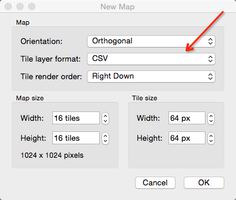
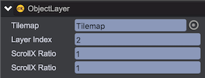

# 瓦片地图
游戏中的地图，使用大量相同元素平铺而成时，建议使用Tilemap进行地图的创建和维护。

## 创建Tilemap资源
目前兼容使用[Tiled Map Editor](http://www.mapeditor.org/)创建的, Orientation为Orthogonal，Tile layer format为CSV，且导出为json格式的地图。  
  
  
  

## 导入Tilemap资源
将导出的json文件后缀改成txt，并使用文本编辑器打开，查找tilesets节点中的name属性，将其修改为对应的图片资源名称（不带后缀名），tilesets节点中的image属性在引擎中不使用，引擎仅根据name属性查找使用的图片资源。
````javascript
 {
// ...
	"tilesets":[
        {
         "firstgid":1,
         "image":"/user/local/tiledmap_src.png",
         "imageheight":64,
         "imagewidth":176,
         "margin":0,
         "name":"tiledmap_src"
         // ...
        }
        // ...
	]
// ...
}
````
* 将txt文件和对应图片资源加入到游戏目录中
* 通过编辑器主菜单（GameObject/Tilemap) 或工具条上的Tilemap按钮创建一个Tilemap对象
* 在Inspector的Tilemap面板上，将导入的txt文件对应的bin资源拖入到Data属性中
* 点击Generate Layers按钮生成图层子对象


以上操作过程，可通过如下代码实现：
````javascript
var tilemap = game.add.tilemap();
tilemapk.data = game.assets.find('tilemapKey');
tilemap.generateLayers();
tilemap.resetNativeSize();
````

以上操作生成了一个Tilemap对象，三个子图层对象：
* __Tilemap__ - qc.Tilemap对象，用于管理和加载子图层
* __Tile Layer 1__ 和 __Tile Layer 2__ - qc.TileLayer图层对象，用于显示图层内容
* __collision__ - qc.ObjectLayer对象图层，用于保存对象图层信息，供用户读取做业务扩展

## Tilemap
  
* __Data__ - 绑定的Tilemap地图资源
* __ScrollX__ - 水平滚动距离
* __ScrollY__ - 竖直滚动距离
* __Generate Layers__ - 生成子图层对象
* __Reset Native Size__ - 将Tilemap对象大小重置为地图尺寸
* __Layers__ - 所有子图层对象数组
* __Tilesets__ - 所有图集资源数组

## TileLayer
  
* __Tilemap__ - 对应的Tilemap地图管理对象
* __Layer Index__ - 所在图层索引
* __ScrollX Ratio__ - 水平移动比例，默认值为1
* __ScrollY Ratio__ - 竖直移动比例，默认值为1

图层移动位置由 tileLayer.scrollXRatio * tilemap.scrollX 和 tileLayer.scrollYRatio * tilemap.scrollY 决定，因此对不同图层设置不同的Ratio移动比例，在地图移动过程不同图层的移动速度，会让用户产生远近层次感效果。  


## ObjectLayer
  
* __Tilemap__ - 对应的Tilemap地图管理对象
* __Layer Index__ - 所在图层索引
* __ScrollX Ratio__ - 水平移动比例，默认值为1
* __ScrollY Ratio__ - 竖直移动比例，默认值为1

## 视频演示 
<video controls="controls"  src="../video/tilemap.mp4"></video>  

## API
* [Tilemap API](http://docs.zuoyouxi.com/api/gameobject/CTilemap.html)
* [TileLayer API](http://docs.zuoyouxi.com/api/gameobject/CTileLayer.html)
* [ObjectLayer API](http://docs.zuoyouxi.com/api/gameobject/CObjectLayer.html)

## Demo
[Demo](http://engine.zuoyouxi.com/demo/Tilemap/tilemap_Mario/index.html)
