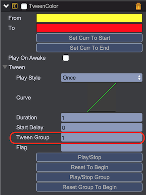

# Tween动画
Tween组件提供了在一定时间周期内，以一定方式改变游戏对象属性值的功能，通过可视化的编辑曲线，可实现各种属性变化的动画效果。例如将游戏对象从A位置移动到B位置，可线性匀速的移动，可先加速后减少，甚至可实现超越终点B位置再反弹的效果。  

## 内置Tween组件
  
* __qc.TweenPosition__ - 游戏对象的position值从from移动到to
* __qc.TweenRotation__ - 游戏对象的rotation值从from旋转到to
* __qc.TweenAlpha__ - 游戏对象的alpha值从from变化到to
* __qc.TweenColor__ - 游戏对象的colorTint值从from变化到to
* __qc.TweenScale__ - 游戏对象的scaleX和scaleY值从from变化到to
* __qc.TweenProperty__ - 指定游戏对象属性值从from移动到to

## Tween插件
  
      
* __qc.TweenFunction__ - 指定延时或间隔调用指定的function

## TweenScale范例
利用TweenScale组件实现一个图片基于中心点自动进行反复缩放的动画效果。

* 创建一个UIImage对象，将其Pivot设置为(0.5, 0.5)
* 点击Add Component按钮添加Tween/TweenScale组件
* 设置From为(0.5, 0.5)，设置To为(2, 2)
* 设置Play Style为PingPong的来回反复模式
* 设置Duration为1秒
* 点击Play/Stop按钮查看运行效果	

 

以上操作可通过如下代码实现：	
````javascript
// 将图片pivot移到中心
image.pivotX = 0.5;
image.pivotY = 0.5;

// 添加TweenScale脚本
var tweenScale = image.addScript('qc.TweenScale');

// 设置起始值
tweenScale.from.x = 0.5;
tweenScale.from.y = 0.5;

// 设置结束值
tweenScale.to.y = 2;
tweenScale.to.x = 2;

// 设置持续时间
tweenScale.duration = 1;

// 设置为反复来回播放模式
tweenScale.style = qc.Tween.STYLE_PINGPONG;

// 设置游戏对象缩放属性为起始值
tweenScale.resetToBeginning();

// 正向播放Tween动画
tweenScale.playForward();
````

## TweenProperty范例
TweenProperty可用于改变number类型属性，属性名可自定义，此例中我们用TweenProperty来改变Dom类型对象的透明度。	

* 创建qc.Dom对象，设置innerHTMl内容
* 点击Add Component按钮添加Tween/TweenProperty组件
* 设置TweenProperty组件property属性为div.style.opacity
* 设置from值为1，to值为0，style为PingPong来回循环方式
* 点击Play/Stop按钮进行动画播放，查看Dom节点组件逐渐变透明和逐渐清晰的反复过程	
 	

## Tween组范例
可将多个Tween组合一起播放达到混合动画效果，这里我们演示组合TweenPosition和TweenColor的动画效果。

* 创建一个UIImage对象
* 点击Add Component按钮添加Tween/TweenColor组件
* 设置TweenColor面板的From为黄色，To为红色，Duration为1秒
* 点击Add Component按钮添加Tween/TweenPosition组件
* 设置TweenPosition面板的From为(100, 100)，To为(200, 200)，Duration为1秒
* 点击TweenPosition的Curve曲线弹出曲线编辑器，通过双击曲线或右键菜单增加两个拐点
* 将TweenColor和TweenPosition的Tween Group属性设置为非0的数值，这里我们设置为1
* 点击TweenColor或TweenPosition面板的Play/Stop Group按钮将会同时驱动颜色和位置的动画效果	
	
   		
 	 

以上操作可通过如下代码实现：	
````javascript
// 初始化TweenColor
tweenColor = image.addScript('qc.TweenColor')
tweenColor.duration = 1;
tweenColor.tweenGroup = 1;
tweenColor.from = qc.Color.yellow;
tweenColor.to = qc.Color.red;

// 初始化TweenPosition
tweenPosition = image.addScript('qc.TweenPosition')
tweenPosition.duration = 1;
tweenPosition.tweenGroup = 1;
tweenPosition.from.set(100, 100);
tweenPosition.to.set(200, 200);

// 重置同组的所有TWeen到起始属性值
tweenColor.resetGroupToBeginning(); // or tweenPosition.resetGroupToBeginning();

// 正向播放同组的所有Tween
tweenColor.playGroupForward(); // or tweenPosition.playGroupForward();
````

*Tween组播放并不仅对同一游戏对象上tweenGroup相同的Tween，所有子孙游戏对象，具有相同tweenGroup的Tween都会被一起播放。*

## Tween曲线编辑

上例中我们对TweenPosition组件自定义了动画曲线，使得节点从from(100, 100)到to(200, 200)的位置并非线性均匀移动，而是先以较慢速度后侧，然后加速前进，超出终点位置后再减速反弹最终达到目标位置。  	
 	 

曲线编辑的结果可通过通过Save as New Curve的右键菜单选项进行保存，保存结果在工程的ProjectSetting/editor.setting的json配置文件的curveTemplate属性中。	  
 	

在关键帧点的右键菜单上可进行，删除关键帧的操作，也可切换关键帧点为Auto、Free Smooth，Flat和Broken等模式。	 
 	

编辑的曲线效果可通过如下代码实现：	
````javascript
tweenPosition.curve.keys = [new qc.Keyframe(0, 0, 1, 1), 
		new qc.Keyframe(0.2, -0.18, -0.3, -0.3), 
		new qc.Keyframe(0.78, 1.2, 0.78, 0.78), 
		new qc.Keyframe(1, 1, 1, 1)];
````		
 
## Tween常用接口

* __duration__ - 动画周期秒数
* __delay__ - 动画启动延迟秒数
* __style__ - 播放方式
	* qc.Tween.STYLE_ONCE - 单次执行
	* qc.Tween.STYLE_LOOP - 循环执行
	* qc.Tween.STYLE_PINGPONG - 往返执行
* __resetToBeginning(reverse)__ - 重置属性值，reverse为true设置为结束值，否则设置为起始值
* __resetGroupToBeginning(reverse)__ - 重置组属性值，reverse为true设置为结束值，否则设置为起始值
* __playForward()__ - 正向播放Tween
* __playReverse()__ - 反向播放Tween
* __playGroupForward()__ - 正向播放组Tween
* __playGroupReverse()__ - 反向播放组Tween
* __stop()__ - 停止播放
* __stopGroup()__ - 停止播放组
* __onStart__ - 开始事件派发器
* __onFinished__ - 结束事件派发器
* __onLoopFinished__ - 循环事件派发器

## API
[Tween API](http://docs.zuoyouxi.com/api/components/Tween.html)

## Demo
[Tween Demo](http://engine.zuoyouxi.com/demo/index.html#anchor_Tween)           