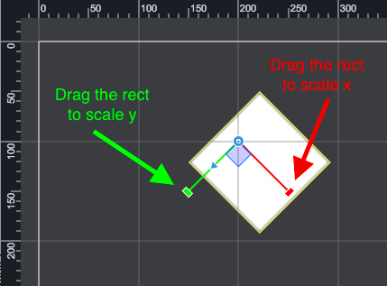
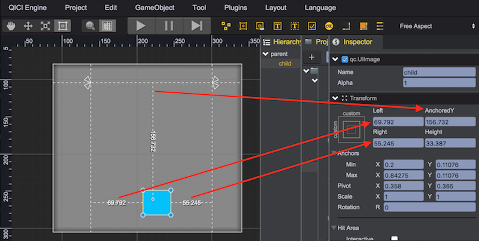

# 布局基础
*提示：可在青瓷引擎编辑器中创建UIImage对象（通过菜单：GameObject/Image）进行编辑测试，以便理解本节内容。*

## Transform
所有游戏对象都具有Transform组件，Transform组件决定了游戏对象在场景中的的位置、大小、旋转和缩放。  
位置、旋转和缩放都是相对于父亲对象，如果未明确指定父亲对象则挂载在game.world的世界对象上。

### 位置
游戏对象原点(pivot point)相对于父亲对象原点(pivot point)的水平和垂直偏移位置
* X - 水平坐标，node.x = 200
* Y - 垂直坐标，node.y = 100    


### 大小
游戏对象的水平宽度和垂直高度，显示基于[Pivot](#pivot)
* Width - 宽度，node.width = 200
* Height - 高度，node.height = 100    


### Pivot
Pivot参数决定自身原点(Pivot Point)在对象矩形区域的位置，自身缩放和旋转，以及孩子对象位置都相对于原点进行。如下例子中：
* Pivot X - 水平相对位置，左边界为0，右边界为1，node.pivotX = 0.2
* Pivot Y - 垂直相对位置，上边界为0，下边界为1，node.pivotY = 0.5  
  

### 旋转
游戏对象基于[Pivot](#pivot)的旋转弧度。__注意：在编辑器中rotation设置为角度，但在游戏代码中得到的为弧度。__
* Rotation - 旋转角度，node.rotation = Math.PI/4  


### 缩放
游戏对象基于[Pivot](#pivot)的水平和垂直缩放系数
* Scale X - 水平缩放，node.scaleX = 0.5
* Scale Y - 垂直缩放，node.scaleY = 1  


### Transform 示例
在编辑器中创建一个UIImage对象，在Inspector中设置如下图所示的属性值：  


以上编辑器操作结果，可在编辑器所在浏览器控制台内输入如下代码运行实现：  
````javascript
    var node = new qc.UIImage(G.game);
    node.texture = G.game.assets.find('__builtin_resource__');
    node.frame = 'empty.png';
    node.colorTint = new qc.Color(0xffff0000);
    node.x = 100;
    node.y = 100;
    node.width = 100;
    node.height = 100;
    node.rotation = -Math.PI/4;
    node.scaleX = 2;
    node.scaleY = 1;
    node.pivotX = 0.5;
    node.pivotY = 0;
````

## Rect Transform

Rect Transform是对应于Transform的另一种布局机制，Transform代表单个点，Rect Transform代表一个对象能被放置的矩形区域。可参考 Demo：[recttransform](http://engine.zuoyouxi.com/demo/Layout/recttransform/index.html)

### Anchors
Rect Transform包含一个布局概念叫锚点，在Node对象上对应为minAnchor和maxAnchor两个顶点属性，分别代表矩形区域的左上角和右下角。游戏对象默认的minAnchor和maxAnchor是重合在左上角位置，这种情况下可理解为Rect Transform不起作用，按Transform方式进行布局。

minAnchor和maxAnchor为相对于父亲对象矩形区域宽和高的相对值，0.0(0%)代表左边或顶边，0.5(50%)代表中心，1.0(100%)代表右边或底边。

*minAnchor.x/minAnchor.y/maxAnchor.x/maxAnchor.y这些值可读取不可设置，只可通过[setAnchor](http://docs.zuoyouxi.com/api/gameobject/node_setAnchor.html)函数进行修改*

在工具条[Transform](../Interface/ToolBar.html#transform)上选择最后一个锚点编辑模式，则场景编辑器上锚点显示为四个小三角形，可直接拖拽小三角形改变minAnchor和maxAnchor值。

*当minAnchor和maxAnchor重合时，拖动点在四个小三角形中心位置时，可同时移动四个三角形。*

### Stretch
当采用Rect Transform进行布局时，除了根据minAnchor和maxAnchor定位相对于父亲节点的矩形区域外，还可通过left、right、top和bottom四个参数设置对矩形区域进行四个方向的绝对值调整。

*拖拽minAnchor和maxAnchor对应的四个小三角形时，按住Shift键可保持left、right、top和bottom不变*

### AnchoredX 和 AnchoredY
位置x和y参数分别代表游戏对象原点(pivot point)相对于父亲对象原点(pivot point)的是水平和垂直距离，anchoredX代表游戏对象原点(pivot point)与minAnchor.x和maxAnchor.x重合点的水平距离，anchoredY代表游戏对象原点(pivot point)与minAnchor.y和maxAnchor.y重合点的水平距离。

一般来说x/y与anchoredX/anchoredY没有直接关系，但当minAnchor和maxAnchor的重合位置正好是父亲对象的原点pivot point位置时，x/y与anchoredX/anchoredY的值一致。

下图中，灰色矩形为父亲，其pivot为(0.5,0.5)，蓝色矩形为孩子，其pivot为(0.2,0.2)，minAnchor和maxAnchor重合在(0.2,0.2)。
  

在Inspector面板中，Transform的内容会根据minAnchor和maxAnchor进行相应变化。  

1. 当minAnchor和maxAnchor重合时显示：anchoredX、anchoredY、width和height  
    

2. 当minAnchor.x和maxAnchor.x重合，minAnchor.y和maxAnchor.y不重合时：anchoredX、top、width和bottom  
    

3. 当minAnchor.x和maxAnchor.x不重合，minAnchor.y和maxAnchor.y重合时：left、anchoredY、right和height  
    

### Rect Transform 示例  


示例中创建了Red作为父亲对象，Blue作为孩子对象，Blue采用Rect Tranform方式布局，其位于父亲节点下方的矩形区域内，并在相对于矩形区域的left、right、top和bottom四个方向上进行内缩。    
  

以上编辑器操作结果，可在编辑器所在浏览器控制台内输入如下代码运行实现：
````javascript
    var node = new qc.UIImage(G.game, red);
    node.texture = G.game.assets.find('__builtin_resource__');
    node.frame = 'empty.png';
    node.colorTint = new qc.Color(0xff0000ff);
    node.setAnchor(new qc.Point(0.1, 0.5), new qc.Point(0.9, 0.9));

    // node.setStretch(left, right, top, bottom)
    node.setStretch(30, 30, 40, 40)

    node.left = 30;
    node.right = 30;
    node.top = 40;
    node.bottom = 40;

    node.pivotX = 0.5;
    node.pivotY = 0;
````

### 案例1
  
对象定位于父亲中心，与父亲中心点保持固定距离

### 案例2
  
对象定位于父亲右下角，与父亲右下角保持固定距离

### 案例3
    
对象左下角与父亲对象左下角保持固定距离，右下角和父亲对象右下角保持固定距离

### 案例4
    
对象左下角与父亲对象左下角保持固定百分比距离，右下角和父亲对象右下角保持固定百分比距离

### Anchor 预置
引擎提供了一些常用的定位模式，通过点击Inspector中Transform面板左上角的Preset按钮可以调出以下界面：  
  
  
