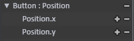

# Action Property  
In the action property view on the left side of [Action Editor](http://docs.qiciengine.com/manual/Action/ActionEditor.html), each property has a constant define and own attributes.    
  
_Position is property. x, y is Position's attributes._  
When we need to change the data of specific property, we can invoke [qc.Action](Action.md).[setData](setData.md). This method uses path, propertyId and attrib parameters to obtain specific attrib of specific property of specific object.   
path: see [setData](setData.md);  
propertyId: property's [constant define](#constant-define), in above picture, is qc.PROP_POSITION;  
attrib: property's [attributes](#attributes-of-properties), in above picture, is x and y.  

## Constant Define
````javascript
qc.PROP_POSITON = 1;               // Position
qc.PROP_ROTATION = 2;              // Rotation
qc.PROP_ALPHA = 3;                 // Alpha
qc.PROP_SCALE = 4;                 // Scale
qc.PROP_COLOR_TINT = 5;            // ColorTint
qc.PROP_VISIBLE = 6;               // Visible
qc.PROP_SIZE = 7;                  // Size
qc.PROP_SKEW = 8;                  // Skew
qc.PROP_TEXTURE = 9;               // Texture
qc.PROP_ANIMATION = 10;            // Animation
qc.PROP_COLOR = 11;                // Color
qc.PROP_TEXT = 12;                 // Text
qc.PROP_PIVOT = 13;                // Pivot
qc.PROP_ANCHORED_POSITION = 14;    // AnchoredPosition
qc.PROP_TOGGLE_ON = 15;            //  ToggleOn
qc.PROP_SCROLLBAR_VALUE = 16;      // ScrollBarValue 
qc.PROP_SCROLLVIEW_POSITION = 17;  // ScrollViewPosition
qc.PROP_PROGRESSBAR_VALUE = 18;    // ProgressBarValue
qc.PROP_SLIDER_VALUE = 19;         // SliderValue
qc.PROP_SOUND = 20;                // Sound
qc.PROP_DOM_INNERHTML = 21;        // DomInnerHTML
qc.PROP_TILEMAP_POSITION = 22;     // TilemapPosition
````
The note of each constant is the property name showed in action property view of [Action Editor](http://docs.qiciengine.com/manual/Action/ActionEditor.html).  
  
## Attributes of Properties  
In the action property view on the left side of [Action Editor](http://docs.qiciengine.com/manual/Action/ActionEditor.html), when property is unfolded, we can see the attributes of this property.    
In above piction, The Position property contains x and y attributes.    
  
The following is the attributes of each property:  
````javascript
qc.PROP_POSITON : { 'x', 'y' }
qc.PROP_ROTATION : { 'rotation' }
qc.PROP_ALPHA : { 'alpha' }
qc.PROP_SCALE : { 'scaleX', 'scaleY' }
qc.PROP_COLOR_TINT : { 'colorTint' }
qc.PROP_VISIBLE : { 'visible' }
qc.PROP_SIZE : { 'width', 'height' }
qc.PROP_SKEW : { 'skewX', 'skewY' }
qc.PROP_TEXTURE : { 'texture' }
qc.PROP_ANIMATION : { 'defaultAnimation' }
qc.PROP_COLOR : { 'color' }
qc.PROP_TEXT : { 'text' }
qc.PROP_PIVOT : { 'pivotX', 'pivotY' }
qc.PROP_ANCHORED_POSITION : { 'anchoredX', 'anchoredY' }
qc.PROP_TOGGLE_ON : { 'on' }
qc.PROP_SCROLLBAR_VALUE : { 'value' }
qc.PROP_SCROLLVIEW_POSITION : { 'horizontalNormalizedPosition', 'verticalNormalizedPosition' }
qc.PROP_PROGRESSBAR_VALUE : { 'value' }
qc.PROP_SLIDER_VALUE : { 'value' }
qc.PROP_SOUND : { 'audio', 'isPlaying' }
qc.PROP_DOM_INNERHTML : { 'innerHTML' }
qc.PROP_TILEMAP_POSITION : { 'scrollX', 'scrollY' }
````
