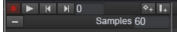
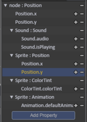
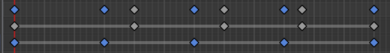
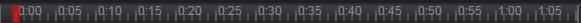
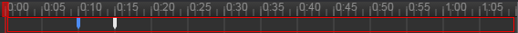
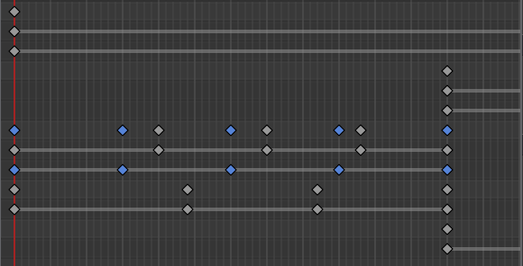
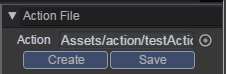
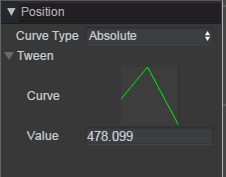
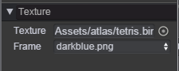
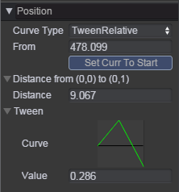

# Action Editor     
The Action Editor can be used to preview and edit _Action Clip_ for animated Game Objects in QICI Engine. The _Action Clip_ can be added to [_Animator_](Animator.md) component. Using [_Animator_](Animator.md) component to play  _Action Clip_.  
The Action Editor allows you to create and modify Animation Clips directly inside QICI Engine. It is designed to act as a powerful and straightforward alternative to external animation programs. In addition to animating movement, the editor also allows you to animate variables of objects and components and augment your _Action Clips_ with _Action Events_, functions that are called at specified points along the timeline.  

## Instruction for Action Editor
The Action Editor can be opened from the _Tool/Action Editor_ menu, or double click _Action Clip_ file in _Assets/Action_ folder. The following picture is the capture of Action Editor:  
   

The Action Editor is divided into three parts. Please see the following:  
* The left side of the Action Editor is the _Action Property View_.    
     
  At the top of the _Action Property View_, there are some buttons: Record、Play、Next Frame、Previous Frame、Add Key Frame、Add Event.  
  
     
  The buttom of the _Action Property View_ is the _Action Property List_. If no _Action Clip_ file is loaded, this list will be empty, the buttons in the _Action Property View_ are disabled.
When an _Action Clip_ file is loaded, the animated properties of the _Action Clip_ will appear here.   
  If the _Action Clip_ controls multiple child objects, the list will also include a hierarchical list of each child object’s animated properties. In the example above, node、Sound、Sprite objects are all animated within the same _Action Clip_, and each animated GameObject is shown according to its hierarchical position in relation to the root object which has the [_Animator_](Animator.md) component attached.   
  At the right side of each property, there is a '-' button that is used to remove the property. At the right side of each exact attribution, there are '+' and '-' buttons that are used to add and delete keyframe of this attribution.  
  
       
  Each property can be folded and unfolded to reveal the exact attributes. When an attribution is selected, all the keyframes of this attribution will show with blue color in the _Timeline View_ of Action Editor, and the _Value_ field in the _Inspector View_ of Action Editor will show the exact value of this attribution in current frame where the playback head (the red line) point to.   
  The _Value_ field can be edited directly. If changes are made when the playback head is over a keyframe, the keyframe’s values will be modified. If changes are made when the playback head is between keyframes (and therefore the value shown was an interpolated value), a new keyframe will be created at that point with the new value that you entered.   

    
  You can browse all animatable properties on the current GameObject ( _Target Object_ ) and its children by clicking the _Add Property_ button. Any property can be animated by selecting it from the _Add Property_ button popup menu.
If _Target Object_ is null, popup menu can't show when clicking the _Add Property_ button.    
  
  
  
* The middle of the Action Editor is the _Timeline View_.    
     
  The top of the _Timeline View_ is the timescale view. You can click anywhere or drag red block on the timescale view to preview or modify that frame in the _Action Clip_. The numbers in the Time Line are shown as seconds and frames, so 1:05 means 1 second and 5 frames.   
  
     
  The next line of the timescale view is the _Action Event window_. You can add an action event to a clip at the current playhead position by clicking the _Add Event_ button or at any point in the action by right-clicking the _Action Event window_ and selecting Add Event from the contextual menu at the point where you want the event to be triggered. Once added, an event can be repositioned by dragging with the mouse. You can delete an event by selecting it and pressing Delete, or by right-clicking on it and selecting Delete Event from the contextual menu.   
  You can press the left mouse button and drag to select multiple action events, then reposition these events at the same time by dragging the mouse.    
  
     
  When you select an action event, the _Inspector View_ panel will show the event edit panel, choose an event function, and set multiple function parameters.  
  
     
  The buttom of the _Timeline View_ is the keyframe view. The keyframes for each animated property appear in this keyframe view.   
  In the region by scrolling the mouse wheel to zoom in or zoom out timeline. When the display area is exceeded, it will show vertical slider on the right side and horizontal slider on the bottom size, drag the slider bar to view the desired display area.    
  Select a keyframe, the playhead will move to this frame, the _Inspector View_ panel will show the property panel for this keyframe. You can press the left mouse button and drag to select multiple keyframes, then reposition these keyframes at the same time by dragging the mouse.      
  
  You can add an keyframe of current attribution at the current playhead position by clicking the _Add Key Frame_ button or clicking the '+' button on the right side of current attribution, or at any point in the keyframe view by right-clicking the keyframe view and selecting Add Key from the contextual menu at the point where you want to add a keyframe. 
  Once added, an keyframe can be repositioned by dragging with the mouse. You can delete an keyframe by selecting it and pressing Delete, or by right-clicking on it and selecting Delete Key from the contextual menu, or by clicking the '-' button on the right side of current attribution.     
  
  
  
* The right side of the Action Editor is the _Inspector View_. The _Inspector View_ is divided into three parts.   
    
  The top part is used to create、load、save _Action Clip_ file.    
  
    
  The center part is used to config properties of the _Action Clip_. There are four properties: name, targetObject, targetLocked, loop.   
  Name: The action's name, the _Action Clip_ file's name by default.  
  Target Object: The gameObject who play the _Action Clip_ file. If it's null, the _Action Clip_ file cann't be played.       
  Target Locked: Whether targetObject is locked. If it's not locked, the [_Animator_](Animator.md) component's gameObject will be set as the targetObject of the _Action Clip_. Or else the targetObject is fixed.     
  Loop: Whether the _Action Clip_ is loop.     
  
       
  The buttom part is used to show property panel and event panel. When select a attribution or a keyframe, the property panel shows. When select an action event, the event panel shows.   
  The property panel has two type: curve type and key type. If the value of attribution is number, the property panel show in curve type for this attribution, or else the property panel show in key type, such as texture like the following:   
     
  
## Instruction for Curve Type  
### Curve Type    
There are four curve types:    
*  Absolute: The value is absolute value, is the real property value of gameObject. Take x property for example, if the value is 110, then the gameObject's x value is also 110.  
*  Relative: The value is the offset value relative to the _From_ value. The _From_ value is the current property value of gameObject. The _From_ value will be set as the current property value of gameObject by clicking the _Set Curr To Start_ button.
In game running, the _From_ value will be set as the current property value of gameObject. Take x property for example, when gameObject's x value in the 0 frame is 100, the _From_ value is 100, if the value is 10, then the gameObject's x value is 100+10=110.    
*  TweenAbsolute: The value is the ratio value of (_To_ - _From_) value. The _From_ value is the real property value in the (0,0) of [Curve Editor](#curve-editor), the _To_ value is the real property value in the (0,1) of [Curve Editor](#curve-editor).
Take x property for example, if the _From_ value is 100, the _To_ value is 200, the value is 0.1, then the gameObject's x value is 100+(200-100)*0.1=110.  
*  TweenRelative: The value is the ratio value of _Distance_. The _From_ value is same as _Relative_. Take x property for example, when gameObject's x value in the 0 frame is 100, the _From_ value is 100, if the _Distance_ value is 100, and the value is 0.1, then the gameObject's x value is 100+100*0.1=110.       
  
  
_TweenAbsolute type is same as [Tween](../Tween/README.md) component. There are the From and To values. The value is generally between 0 and 1. Using TweenAbsolute and TweenRelative, we can change the From and To value in code. It's also same as [Tween](../Tween/README.md)._  

### Curve Editor
Click curve button to open curve editor, see the following:  
   
The x-axis is frame, y-axis is the curve value.  
In the Curve Editor, you can add, delete, move keyframes, you can also modify the in-angle and out-angle of each keyframe.  The keyframes in the Curve Editor and the keyframes in the keyframe view is one-to-one match, change the keyframes in the Curve Editor, will be in the keyframe view simultaneously reflected.  
  
## Using Action Events   
We have introduce how to create, delete and move action events in the [Instruction for Action Editor](#instruction-for-action-editor).  
you select an action event, the _Inspector View_ panel will show the event edit panel, like the following:  
   
Click the Function list box, it will list all custom functions of all scripts attached to targetObject. The function support more than one parameters. The parameter value must be string.
When _Play In Editor_ is unchecked, action event won't be triggered in the Action Editor.  
  
## Record Action Clip      
When open the Action Editor, the Action Editor is in the _record mode_ by default. The record button is: .  
In the _record mode_, the changes you make to the gameObject will be recorded as keyframes at the current time shown by the red line in the Action Editor if the changed property is an animated property of the _Action Clip_.  
  
You can animate any animated property of the _Action Clip_ by manipulating the object in the scene of QICI Engine. Moving, Rotating or Scaling the object will add corresponding keyframes for those properties in the _Action Clip_. Adjusting values directly in the object’s inspector will also add keyframes while in record mode.   
The following video is an example how to create a heart-path movement by animating the object in the scene of QICI Engine.     
<video controls="controls" src="../video/heartPath.mp4"></video>  

## Using Script to Control Action    
The [_Animator_](Animator.md) component supports many functions to control action.    
### Play Action  
````javascript
	// Animator's gameObject play first action
	this.gameObject.Animator.play();
	
	// Animator's gameObject play second action
	this.gameObject.Animator.play(1);
	
	// Animator's gameObject play test action
	this.gameObject.Animator.play('test');
	
	// Animator's gameObject play test2 action
	this.gameObject.Animator.play('test2');
	
	// Ob object play test actoin 
	this.gameObject.Animator.play('test', Ob);
````  
An [_Animator_](Animator.md) component can play multiple actions, but the same action can only be played once at the same time.  

### Stop Action
````javascript
	// play test action
	this.gameObject.Animator.play('test');
	
	// stop test action
	this.gameObject.Animator.stop('test');
	
	// resume test action
	this.gameObject.Animator.play('test', null, false);
````  
When action stops, if you want to resume the action, you can pass false as the third parameter when calling play function.  

### Change Curve Data  
````javascript
	// get test action
	var action = this.gameObject.Animator.getAction('test');
	
	// If curveType of x attrib is TweenAbsolute in the action clip, we can set from、to parameters for the action 
	action.setData('/', qc.PROP_POSITON, 'x', { from : 0, to : 100 });
	
	// If curveType of x attrib is TweenRelative in the action clip, we can set to parameters for the action 
	action.setData('/', qc.PROP_POSITON, 'x', { to : 100 });
	
	// play test action
	this.gameObject.Animator.play('test');
````  
We use the [setData](http://docs.zuoyouxi.com/api/action/setData.html) method to set curve data. 

### Change Action Property  
````javascript
	// get test action
	var action = this.gameObject.Animator.getAction('test');
	
	// set loop  
	action.loop = true;
	
	// set samples  
	action.samples = 60;
	
	// play test action
	this.gameObject.Animator.play('test');
````  

### Action Finish Event  
````javascript
	// get test action
	var action = this.gameObject.Animator.getAction('test');
	
	// The event is triggered when action is finished.  
	action.onFinished.add(function(action) { consolo.log('action is finished.'); } );
	
	// The event is triggered when every loop is finished.  
	action.onLoopFinished.add(function(action) { consolo.log('action is loop finished.'); } );
	
	// play test action
	this.gameObject.Animator.play('test');
````  

## API
[Action API](http://docs.zuoyouxi.com/api/action/Action.html)

## Demo
[Action Demo](http://engine.zuoyouxi.com/demo/index.html#anchor_Action)