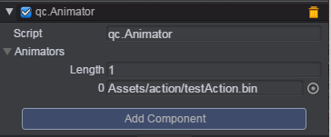

# Animator Component 
If game object need to play _Action Clip_ or _Action Manager Clip_ file, it must mount an [Animator Component](Animator.md). Like the following:  
  
In above picture, Animators can have many _Action Clip_ or _Action Manager Clip_ files. It means that a game object can play many _Action Clip_ or _Action Manager Clip_.  
The _Action Clip_ file is generated by [Action Editor](ActionEditor.md). The _Action Manager Clip_ file is generated by [Action Manager](ActionManager.md).    

## API  
* Get action object by action name or index of Animators array.    
Prototype: getAction(nameOrIndex)   
nameOrIndex：action name or index of Animators array  
````javascript
	// get first action
	var action = this.gameObject.Animator.getAction(0);
````  
* Play action.  
Prototype: play(nameOrIndex, targetObject, fromBegin)   
nameOrIndex：Action name or index of Animators array, 0 by default.    
targetObject: Target object who play this action, this Animator's gameObject by default.    
fromBegin: Whether play from begin, true by default.     
````javascript
	// play first action
	this.gameObject.Animator.play();
````  
* Stop action.  
Prototype: stop(nameOrIndex)   
nameOrIndex: Action name or index of Animators array, 0 by default.    
````javascript
	// stop first action
	this.gameObject.Animator.stop();
````  

## Demo 
[Action Demo](http://engine.zuoyouxi.com/demo/index.html#anchor_Action)