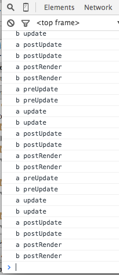
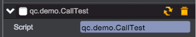

# Execution Order of Event Functions

In Behaviour scripting, there are a number of event functions that get executed in a predetermined order as a script executes. This execution order is described below:

## Sample Code
1. Create a new script CallTest.js in Assets/Scripts folder

````javascript
var CallTest = qc.defineBehaviour('qc.demo.CallTest', qc.Behaviour, function() {

}, {
    // Fields to be serialized
});

CallTest.prototype.awake = function() {
    console.log(this.name, 'awake');
};

CallTest.prototype.onEnable = function() {
    console.log(this.name, 'onEnable');
};

CallTest.prototype.onDisable = function() {
    console.log(this.name, 'onDisable');
};

CallTest.prototype.preUpdate = function() {
    console.log(this.name, 'preUpdate');
};

CallTest.prototype.update = function() {
    console.log(this.name, 'update');
};

CallTest.prototype.postUpdate = function() {
    console.log(this.name, 'postUpdate');
};
````

2. Create two Empty Nodes in scene, name them as 'a' and 'b' respectively, and add qc.demo.CallTest script component on them.	   
	  	
3. Run it to check print result on console.	 
	 	
4. Disable the script component and check print result again.	
		

## Calling Sequence
1. awake
2. onEnable
3. preUpdate
4. update
5. postUpdate
