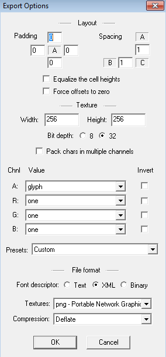

# Creation and Use of Bitmap Font

## Software
We use freeware [Bitmap Font Generator](http://www.angelcode.com/products/bmfont/) for generating bitmap fonts, and explain how to use bitmap fonts in QICI Engine.

The following are some other tools that also generate output in the same format and are widely used in the industry today:
1. [Littera](http://kvazars.com/littera/) - free web application
2. [Glyph Designer](https://71squared.com/glyphdesigner) paid app for Mac
3. [ShoeBox](http://renderhjs.net/shoebox/) free tool written with Adobe Air
4. [Hiero](https://github.com/libgdx/libgdx/wiki/Hiero) open source tool written in Java

## Generating Bitmap Fonts
1. Open Bitmap Font Generator software, select menu Options/Font Setting:    
	  
Choose font family, change font size. If using imported images, do not need this step.  

2. Select menu Options/Export options：    
	    
Set width and height for exported image, and change File format to XML.  

3. If using imported images, select menu Edit/Open Image Manger to import images for chars：  
	  

4. Select menu Edit/Select chars from file for selecting chars for exporting. If using imported images, you need to set Id value for every char. You can use unicode convertion tool to get Id, or using JavaScript on broswer console by typing: 'Q'.charCodeAt(0)    
	    
	    

5. Select menu Options/Save bitmap font as... to export bitmap fonts. After exporting, we get two files, one with .fnt suffix and another one with .png suffix.

## Importing Bitmap Fonts
1. Rename file with .fnt suffix to .xml suffix, and keep fnt and xml files have the same name:
	* file.fnt -> custom.xml
	* file.png -> custom.png
2. Drag the two files into Project panel, for example in Assets/bitmapfont/custom.bin

## Setting Bitmap Fonts for UIText
1. Set UIText's Font Family property as Bitmap
2. Set UIText's Font property as the Assets/bitmapfont/custom.bin  
	

## Demo
[BitmapFont Demo](http://engine.qiciengine.com/demo/UIText/font_bitmap/index.html)
