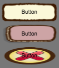

# TransitionBehaviour
The qc.TransitionBehaviour script is used to change the game object's appearance depending on the state of the game object. Currently the TransitionBehaviour supports change texture and change tint color. The [Button](../Sample/Button.html) and [InputField](../Sample/InputField.html) both have a built-in TransitionBehaviour script.

The game object that has TransitionBehaviour script added should has the state property, the valid state value is:
* qc.UIState.NORMAL - The normal state
* qc.UIState.PRESSED - The pressed state
* qc.UIState.DISABLED - The disabled satte

## Texture Swap
Allows different texture to display depending on what state the game object currently in.  
  
The picture below displays the game object's appearance in normal, pressed and disabled state.  
  
````javascript
var tb = button.getScript('qc.TransitionBehaviour');
tb.transition = qc.Transition.TEXTURE_SWAP;
// The frame value in normal state
tb.normalTexture = 'button1';
// The frame value in pressed state
tb.pressedTexture = 'button2';
// The disabled value in pressed state
tb.disabledTexture = 'button2';
````

## Color Tint
Allows different color to tint depending on what state the game object currently in.  
  
The picture below displays the game object's appearance in normal, pressed and disabled state.  
  
````javascript
var tb = button.getScript('qc.TransitionBehaviour');
tb.transition = qc.Transition.COLOR_TINT;
// The colorTint value in normal state
tb.normalColor = new qc.Color(0xffffffff);
// The colorTint value in pressed state
tb.pressedColor = new qc.Color(0xffcccccc);
// The colorTint value in disabled state
tb.disabledColor = new qc.Color(0xffcccccc);
````

## API
* [TransitionBehaviour API](http://docs.qiciengine.com/api/components/TransitionBehaviour.html)

## Demo
* [change-texture Demo](http://engine.qiciengine.com/demo/Button/disable-change-texture/index.html)
* [change-color Demo](http://engine.qiciengine.com/demo/Button/disable-change-color/index.html)
