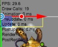
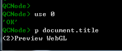
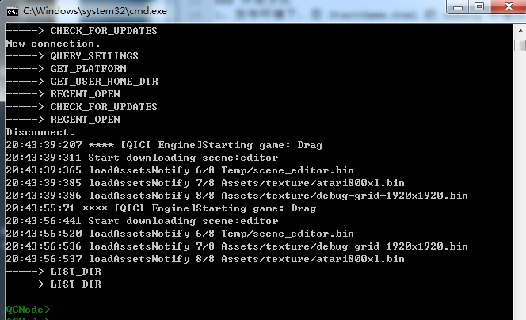

# Debugging and Profiling

## Debug Component

1. Add an UIText node, adjust it's position and size.   
2. Add [Debug/DebugViewer](../BuildinComponents/DebugViewer.html) component on the UIText node.  
     
      

Note: The default frame rate is 60 on desktop and 30 on mobile, user can get and set it from accessing game.time.frameRate property.
In editor for better user experience, we set the frame rate to 30 in StartScene.templet.html   

## Remote Interactive Debug  
In nodejs console of QICI Editor, we can input command to interactive with client, to query or set variables in client. It's very useful for debugging game in phone. For example:   
   
Note that: The nodejs console of QICI Editor and [Simple Server](../Plugin/server.html) already support the remote interactive function.   

### How to Enable  
1. In publish environment, adding `remoteLogUrl` to qici.config in StartGame.html, such as: http://115.159.121.224:5002  
````javascript
	qici.config.remoteLogUrl = 'http://115.159.121.224:5002';
````  
Url is the address of your QICI Editor's.   
2. In Preview enviroment, PreviewGameCanvas.html or PreviewGameWebGL.html have been added `remoteLogUrl`, we can directly interactive with client in nodejs console of QICI Editor.   

### How to Interactive  
1. When interactive with single client, using `p` command to interactive, for example:  
  
2. When interactive with multiple clients, there is two way to interactive:  
	* Using `use` command to switch client; then using `p` command to interactive, for example:  
  
__The client's ID show in title of window__, see the following:  
    
	* Using `p%id%` command to interactive, for example:      
   
3. Using `use 0` command:   
When `use` command had been used to switch client, now we want to interactive with single client, can use `use 0` command, then use `p` comannd. For example:  
   

### Remote Log  
Adding `remoteLogUrl` to qici.config such as above, the log generated by methods of [game.log](http://docs.zuoyouxi.com/api/log/index.html) will upload to the url.  
When the url is the address of QICI Editor, the log will show in nodejs console of QICI Editor.  
   

## Third-Party Tool

We recommend to use Chrome's built-in authoring and debugging tool [Chrome DevTools](https://developers.google.com/web/tools/chrome-devtools/). 
The Chrome DevTools are a set of web authoring and debugging tools built into Google Chrome. 
They provide web developers deep access into the internals of the browser and their web application. 
Use the DevTools to efficiently track down layout issues, set JavaScript breakpoints, and get insights for code optimization.   
    

## Demo
[DebugView Demo](http://engine.qiciengine.com/demo/Debug/debug_info/index.html)    
