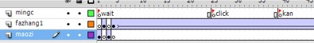
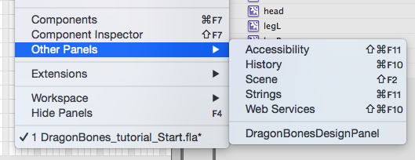
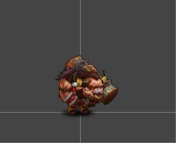
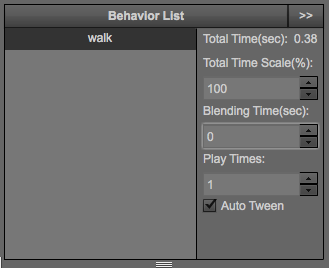
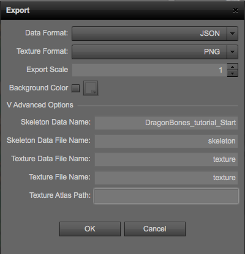
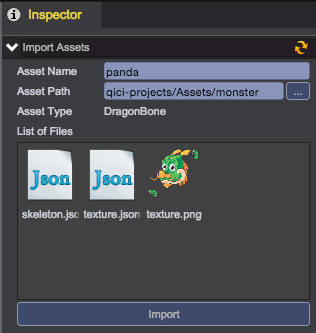

# Skeleton Animation

DragonBones is an open source 2D skeleton animation solution, 
QICI Engine supports [DragonBones](http://dragonbones.effecthub.com/download.html) skeleton animation data format. 
You can read the [Get started guide](http://dragonbones.effecthub.com/getting_started_en.html) 
to learn how to setup and use DragonBones in your project.   

## Software Requirements
* [Adobe Flash Professional CS6](http://www.adobe.com/)
* [DragonBones 3.0](http://dragonbones.effecthub.com/download.html), The Skeleton Animation Design Panel, a Flash Pro based extension.

## Notices
1. Every single frame in one layer can only carry one symbol. If your want to copy symbol, you have to create a new layer.    
	   
2. You'd better convert image to symbol only once, if the same image has been converted to symbol twice, there will be two identical images exported.   
3. If there are different symbols in different frames of the same layer, do not process continuously, but create one more layer and edit them in different layers.   
	   
4. Name every behavior frames in a layer    
	   
5. Naming convention and managing floders   
	* Don't use non-Ascii characters    
    * Use 3 floders: one for part symbols, another one for main symbols, the last one for images    
       

## Export DragonBones Skeleton Animation Data
1. Open DragonBonesDesignPanel from menu Window/Other Panels/DragonBonesDesignPanel 
	  
2. Select Import button to import data：  
    
3. Edit imported behaviors  
	          
	* Set Blending Time(sec) to 0 
	* Set Play Times to 1 means only once, 0 means infinite loop 
4. Preview all behaviors in play panel        
	   
5. Select Export button to export data：  
	   
	* Data Format：JSON
	* Texture Format：PNG
	* If exported image is too large, you can change Export Scale
6. After export, we get 3 files：
	* skeleton.json - animation description file
	* texture.json - texture atlas description file
	* texture.png - texture atlas

## Import to QICI Editor Project - Solution 1:  
1. Modify 3 files to have same prefix name, for example: panda
    * skeleton.json -> panda.ani
    * texture.json -> panda.json
    * texture.png -> panda.png
2. Drag these 3 files to the folder of Assets/monster in Project to finish import

<video controls="controls" src="../video/import_dragonbone1.mp4"></video> 

## Import to QICI Editor Project - Solution 2:  
1. Select ment Tool/Import Assets：  
    
2. Drag skeleton.json, texture.json, and texture.png into Import Assets Panel, name it and click import：    
    

<video controls="controls" src="../video/import_dragonbone2.mp4"></video>  

## Sample Frames
After sampling, QICI Core can has much better performance for rendering skeleton animation.
1. Select the imported skeleton animation resource
2. In inspector panel, click Sampled button to finish sampling frames  
      

<video controls="controls" src="../video/sampled_dragonbone.mp4"></video> 
