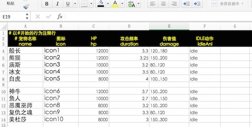

# Using Excel

Excel is powerful and highly customizable, it's very friendly to game designers. 
Therefore, we strongly recommend you to use Excel tool to help you design game. 
Do not hard code configurable data, use Excel and let the designers to config it. 

## Supported Data Formats
  
* Rows that start with '#' will be tried as comments when parsing
* The first non-comment and non-empty row is tried as the row for column names 
* The followings are configure contents, formula operation are supported
* Multiple sheets are supported

## Import Excel File
Just drag Excel file with .xlsx suffix into Assets/excel folder in Project panel. 

## Using Excel Sample
1. Create an excel file: config.xlsx, which contains 2 sheets and contents as follows:    
    
    
2. Drag config.xlsx file to Assets/excel folder in Project panel.
3. Write code to access the excel configure data. Add a script: ExcelTest.js：
````javascript
	var ExcelTest = qc.defineBehaviour('qc.demo.ExcelTest', qc.Behaviour, function() {
	}, {
	    // Fields to be serialized
	});

	// initialization
	ExcelTest.prototype.awake = function() {
	    // load excel data
	    var self = this;
	    self.game.assets.load('config', 'Assets/excel/config.bin', function(data) {
	        // data is type of qc.ExcelAsset
	        console.log('Download OK.', data);

	        // read data
	        self.read();
	    });
	};

	// read data
	ExcelTest.prototype.read = function() {
	    // get loaded data
	    var data = this.game.assets.find('config');

	    console.log('sheets', data.sheetsName);

	    // key is the name of sheet，value is data(type of qc.ExcelSheet)
	    console.log('datas', data.sheets);

	    // read Monsters sheet
	    var monsters = data.findSheet('Monsters');
	    console.log('column name', monsters.columns);
	    console.log('lines', monsters.rows);

	    // convert data to name and value mapping
	    var o = {};
	    monsters.rows.forEach(function(row) {
	        o[row.name] = row;
	    });
	    console.log('formated data', o);
	};
````
4. Add this script component to any Node and run it, check console log to understand the API interface

## API
Please refer to the related API documents for more details:   
* [ExcelAsset](http://docs.qiciengine.com/api/assets/ExcelAsset.html)
* [ExcelHashSheetIndex](http://docs.qiciengine.com/api/assets/ExcelHashSheetIndex.html)
* [ExcelSortSheetIndex](http://docs.qiciengine.com/api/assets/ExcelSortSheetIndex.html) 

## Demo
[Excel Demo](http://engine.qiciengine.com/demo/misc/excel/index.html)      