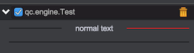
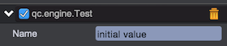
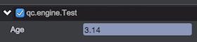
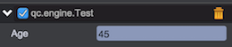
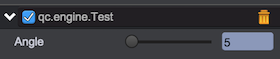
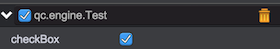
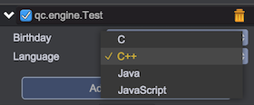

# GUI Components

*qc.editor.gui is a global object, it's abbreviated to gui below*

gui provides some convient mehtod for creating components to add to the panel.

## gui.text(text, properties, layoutConfig)
Create and return a qc.editor.Text component:	
* __text__: The string content
* __properties__: The object for text's properties, optional
* __layoutConfig__: The object for layout params:	
	* __colspan__: The span column count
	* __rowspan__: The span row count
	* __cellPadding__: The padding in cell, array format: [top,right,bottom,left], or a number for 4 sides
	* __fill__: The fill mode:
		* __'fill'__: The default value to fill the whole component into the cell
		* __'none'__: The component will be in its preferenced size
		* __'h'__或__'horizontal'__: The component's width will fill the cell, the height will be the small value of preference's height and cell's height	
	* __align__: The horizontal align: 'left', 'right' or 'center'. Used when fill mode is none
	* __vAlign__: The vertical align: 'top', 'bottom' or 'middle'. Used when fill mode is none
	* __keepRatio__: If the component's preferenced size is bigger than the cell, you can set keepRatio as true to make the component shrink but keep ratio to display. The default value is false

Return value：The qc.editor.Text instance

```javascript
gui.columnWidths = ['100+0.1'];
// Create a text with content 'Text1'
gui.line([
	gui.text('Text1')
]);
// Create a text with red background and center in the cell
gui.line([
	gui.text('Text2', { background: '#ff0000' }, { fill: 'none', align: 'center', vAlign: 'middle' })
], 100);
```


Text component has a special property: 'for', the 'for' property will let the let the text bind with a number input field that has the same id with the 'for' value. If the text bing with a number input field, you can directly drag on the text component just like a slider, when dragging the text component will change the number input field's value automatically:		
```javascript
gui.columnWidths = ['80+0.1', '100+0.1'];
// Create a text binding with the number input component with id 'age'
gui.line([
	// set max, min and step value for the text 
	gui.text('Age', { for: 'age', max: 100, min: 18, step: 1 }),// 
	gui.numberInput({ id: 'age' }) 
]);
```

* __max__: The max value for dragging
* __min__: The min value for dragging
* __step__: The step value for dragging

## gui.label(text, properties, layoutConfig)
Create and return a qc.editor.Label component.

Label is similar with Text, but the Label component can display icon, so it's a litter heavier than Text component. In short, if you just need to display text, use Text component, if you need to display a icon, use Label component.  

```javascript
gui.columnWidths = ['100+0.1'];
// Create a label with a icon 
gui.line([
	gui.label('label1', { icon: 'http://bbs.zuoyouxi.com/static/image/common/online_admin.gif', iconStretch: 'uniform' })
]);
// Create a label with background color and a icon that has a 'uniform' stretch mode
gui.line([
	gui.label('label2', 
	{ background: '#ff0000', icon: 'http://bbs.zuoyouxi.com/static/image/common/online_moderator.gif', iconStretch: 'uniform' }, 
	{ fill: 'none', align: 'center', vAlign: 'middle' })
], 100);
```


*The Label component has the same 'for', 'max', 'min' and 'step' properites like the Text component*

## gui.divider(properties, layoutConfig)
Create and return a qc.editor.Divider component.

```javascript
gui.columnWidths = ['60+0.1', '60+0.1', '60+0.1'];
gui.line([
	gui.divider(),
	gui.text('normal text', { align: 'center' }),
	gui.divider({ color: 'red' })
]);
gui.line([
	gui.divider(null, {colspan: 3})
]);
```


## gui.empty(layoutConfig)
Create an Empty component.

Sometime you need to leave blanks, you can create Empty components to occupy these cells.
```javascript
gui.columnWidths = ['60+0.1', '60+0.1', '60+0.1'];
gui.line([
	gui.empty({ colspan: 2 }), // Leave the first and second column to be blank
	gui.text('normal text')
]);
```

## gui.button(text, properties, layoutConfig)
Create and return a qc.editor.Button component.

```javascript
gui.columnWidths = ['100+0.1'];
var button;
Create a Button component with 'button' text
gui.line([
	button = gui.button('button')
]);
// Add a click event listener 
button.on('click', function(e) {
	alert('click on button')
});
```


## gui.buttonGroup(items, properties, layoutConfig)
Create and return a qc.editor.ButtonGroup component.
```javascript
gui.columnWidths = ['60+0.1', '100+0.1'];
gui.line([
	gui.text('Align'),
	gui.buttonGroup([
        {
            text: 'Left',
            value: 'Left'
        },
        {
            text: 'Center',
            value: 'Center'
        },
        {
            text: 'Right',
            value: 'Right'
        }
    ], { bind: 'align' })// Binding with the Behavior script's 'align' property
]);
```

The 'bind' is a very important property for all mutable component such as numberInput and stringInput. It's a powerful and convinent two-way binding for GUI component and Behavior script. Like the sample above, user can change script's align value by selecting the button, and when script's align value is changed programmly, the result will be displayed on the GUI interface automatically.

## gui.stringInput(properties, layoutConfig)
Create and return a qc.editor.StringInput component.
```javascript
gui.columnWidths = ['60+0.1', '100+0.1'];
var input;
// Create a StringInput component ant set the value
gui.line([
	gui.text('Name'),
	input = gui.stringInput({ value: 'initial value' })
]);
// Define the onValueChanged method to alert when the input value is changed
input.onValueChanged = function(newValue) {
	alert(newValue);
};
```



## gui.textArea(properties, layoutConfig)
Create and return a qc.editor.TextArea component.
```javascript
gui.columnWidths = ['60+0.1', '100+0.1'];
var textArea;
Create a TextArea component and set the multiline content
gui.line([
	gui.text('Description'),
	textArea = gui.textArea({ value: 'line1\nline2\nline3' })
], 100);
// Define the onValueChanged method to alert when the input value is changed
textArea.onValueChanged = function(newValue) {
	alert(newValue);
};
```


## gui.numberInput(properties, layoutConfig)
Create and return a qc.editor.NumberInput component for inputting number value.

```javascript
gui.columnWidths = ['60+0.1', '100+0.1'];
var input;
gui.line([
	gui.text('Age'),
	// __value__: The current value
	// __min__: The min value
	// __max__: The max value
	// __precision__: The number of digits to appear after the decimal point
	input = gui.numberInput({ value: 3.14, min: 0, max: 100, precision: 5 })
]);
// Define the onValueChanged method to alert when the input value is changed
input.onValueChanged = function(newValue) {
	alert(newValue);
};
```


## gui.intInput(properties, layoutConfig)
Create and return a qc.editor.IntInput component for inputting integer value.

```javascript
gui.columnWidths = ['60+0.1', '100+0.1'];
var input;
// Create a IntInput with initial value 3
gui.line([
	gui.text('Age'),
	input = gui.intInput({ value: 3 })
]);
// Define the onValueChanged method to alert when the input value is changed
input.onValueChanged = function(newValue) {
	alert(newValue);
};
```


## gui.angleInput(properties, layoutConfig)
Create and return a qc.editor.AngleInput component. Normally the rotation value is operated in memory by radian, but using angle is much better for reading and setting. So the AngleInput is this kind of component that will display radian value as angle value for reading, but when setting value, it will convert angle to radian automatically.
```javascript
gui.columnWidths = ['60+0.1', '100+0.1'];
var angleInput;
gui.line([
	gui.text('Angle'),
	angleInput = gui.angleInput({ bind: 'angle' })
]);
// Define the onValueChanged method to alert when the input value is changed
angleInput.onValueChanged = function(newValue) {
	// the newValue is angle value
	console.log(newValue);
};
```


## gui.sliderInput(properties, layoutConfig)
Create and return a qc.editor.SliderInput component.
```javascript
gui.columnWidths = ['60+0.1', '100+0.1'];
var sliderInput;
gui.line([
	gui.text('Angle'),
	sliderInput = gui.sliderInput({value: 50, min: 0, max: 200, step: 10})
]);
// Define the onValueChanged method to alert when the input value is changed
sliderInput.onValueChanged = function(newValue) {
	alert(newValue);
};
```


## gui.checkBox(properties, layoutConfig)
Create and return a qc.editor.CheckBox component.

```javascript
gui.columnWidths = ['60+0.1', '100+0.1'];
var checkBox;
gui.line([
	gui.text('checkBox'),
	checkBox = gui.checkBox({ selected: true })
]);
// Define the onValueChanged method to alert when the input value is changed
checkBox.onValueChanged = function(newValue) {
	alert(newValue);
};
```


## gui.dropDownList(properties, layoutConfig)
Create and return a qc.editor.DropDownList component for single-selection from a drop-down list.

```javascript
gui.columnWidths = ['60+0.1', '100+0.1'];
var dropDownList;
gui.line([
	gui.text('Birthday'),
	dropDownList = gui.dropDownList({ 
		// Array of items for drop-down list
		items: ['1988', '1989', '1990', '1991', '1992', '1993', '1994', '1995'],
		// The default selected value
		value: '1988'
	})
]);
// Define the onValueChanged method to alert when the input value is changed
dropDownList.onValueChanged = function(newValue) {
	alert(newValue);
};

gui.line([
	gui.text('Language'),
	gui.dropDownList({ 
		// Using object as item, 'label' for displaying, 'value' for internal value
		items: [
			{ label: 'C', value: 0 }, 
			{ label: 'C++', value: 1 },
			{ label: 'Java', value: 2 },
			{ label: 'JavaScript', value: 3}
		],
		value: 1
	})
]);
```



## gui.multiDropDownList(properties, layoutConfig)
Create and return a qc.editor.MultiDropDownList component for multi-selection from a drop-down list.

```javascript
gui.columnWidths = ['60+0.1', '100+0.1'];

gui.line([
	gui.text('Language'),
	gui.multiDropDownList({ 
		items: [
			{ label: 'C', value: 0 }, 
			{ label: 'C++', value: 1 },
			{ label: 'Java', value: 2 },
			{ label: 'JavaScript', value: 3}
		],
		value: [1, 2]
	})
]);
```


## gui.colorPicker(properties, layoutConfig)
Create and return a qc.editor.ColorPicker component to display and change color.

```javascript
gui.columnWidths = ['60+0.1', '100+0.1'];
var colorPicker;

gui.line([
	gui.text('Background'),	
	colorPicker = gui.colorPicker({value: new qc.Color(0xfffff600)})
]);
colorPicker.onValueChanged = function(newValue) {
	alert(newValue);
};
```
  
Click on the component to pop up a color picker dialog to change color:  
  

## gui.objectInput(properties, layoutConfig)
Create and return a qc.editor.ObjectInput component for binding with game object or assets object(texture, sound, font, .etc). User can change the value directly by dragging the game object in hierarchy panel or asset in project panel to drop on the object input component.

*The ObjectInput must be used in bind mode.*

* __properties__ 
	* objectType: The object type that is supported, the valid values:  		
		* 'prefab': Prefab object
		* 'texture': Texture asset
		* 'sound': Sound asset
		* 'font': Font asset
		* 'textAsset': Text asset
		* 'excelAsset': Excel asset
		* 'bitmapFont': BitmapFont asset
		* 'node': Game object
	* target: The target object for binding
	* bind: the property for binding

```javascript
gui.columnWidths = ['60+0.1', '100+0.1'];
gui.line([
	gui.text('Node'),
	gui.objectInput({objectType: 'node', target: {this.target}, bind: 'node'})
]);
```


