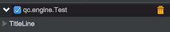

# GUI Layout

GUI uses table layout system, component could be place in single cell or span rows and columns in table layout system.

*qc.editor.gui is a global object, it's abbreviated to gui below*

## gui.columnWidths

gui.columnWidths determines the columns count, must be set before adding components.

```javascript
// The code splits the panel into 3 columns
// The first column with a fixed width 50px
// The second column with a min width 60px and a extra weight 0.1
// The third column with a min width 50px and a extra weight 0.3
// The weight is used to assign extra width when the panel is wider than the sum of fixed and min widths	
// i.e. the width of the panel is 200px, the 3 column's sum width is 160px(50+60+50), 
// then there is still 40px(200-160) left, so the final result is:
// The first column: 50px
// The second column: 60 + 0.1/(0.1+0.3)*40 = 60 + 10 = 70px
// The third column: 50 + 0.3/(0.1+0.3)*40 = 50 + 30 = 80px
gui.columnWidths = [50, '60+0.1', '50+0.3'];
```

You can even change the gui.columnWidths value when drawing the panel:
```javascript
// Defines the table layout as 3 columns
gui.columnWidths = [60, '60+0.1', '50+0.3'];
gui.line([
	gui.button('button1'),
	gui.button('button2'),
	gui.button('button3')
]);
// redefine the table layout as 2 columns
gui.columnWidths = ['10+0.1', '10+0.1'];
gui.line([
	gui.text('text1'),
	gui.label('label1')
]);
```
See the result as below:  


Notice:
Change the columnWidths will cause the panel to create a sub panel internally, so for better perfomance, we recommand to use the feature of spanning rows and columns.

## gui.line(columns, height)
Insert a new row in the panel  
* __columns__: A Array of components
* __height__: The row height(optional, default 20)

```javascript
// gui.columnWidths must be set first 
gui.columnWidths = [60, '60+0.1', '50+0.3'];

// Add a new row with 3 components: two buttons and one text, each one in a column
gui.line([
	gui.button('button1'),
	gui.button('button2'),
	gui.text('normal text')
]);

// Add a new row with 2 buttons, the first button in the first column, the second button span two columns  
gui.line([
	gui.button('button1', {}, {colspan: 2}),
	gui.button('button2')
]);	
```
See the result as below:  


## gui.titleLine(title, collapsed)
Add a title line, the title line can expand and collapse the contents below it

* __title__: String type for title content
* __collapsed__: Boolean type determining to collapse or not, optional, default as false

Return a object for adding rows

```javascript
// Must be set first
gui.columnWidths = [60, '60+0.1', '50+0.3'];

var titleLine = gui.titleLine('TitleLine');
// Add a first row for the titleLine
titleLine.add(gui.line([
	gui.button('button1'),
	gui.button('button2'),
	gui.text('normal text')
]));
// Add a second row for the titleLine
titleLine.add(gui.line([
	gui.stringInput(),
	gui.button('button'),
	gui.stringInput()
]));
```
See the result of expanding:  


See the result of collapsing:  




