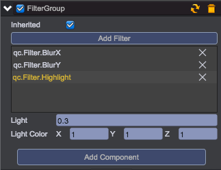
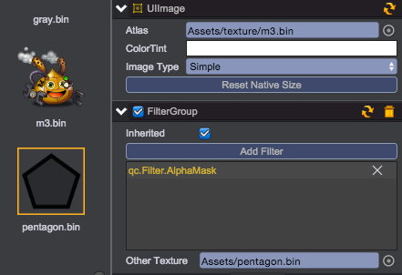
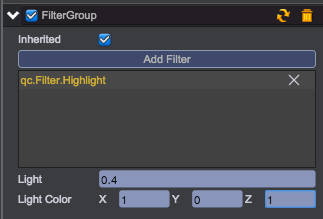
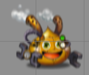
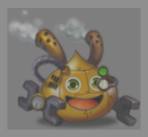
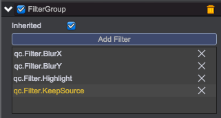

# Filter
__Notice：Filters work only in WebGL rendering mode, not working in Canvas rendering mode.__

## Using Filter

1. Add UI/FilterGroup component onto any UIImage   
 

2. Click Add Filter button to add one or more filters, an UIImage can have mutilple filters to show various effects of blending.    
 

## Filter Type

The built-in filters support the effects as followings：

1. __qc.Filter.AlphaMask__   
      
     
Other Texture: uses another image's alpha information to blend the original image   

2. __qc.Filter.Highlight__  
          
     
Light: 0~1, highlight factor      
Light Color: highlight color    
  
3. __qc.Filter.BlurX__  
          
       
Blur: horizontal blur factor          
  
4. __qc.Filter.BlurY__   
          
       
Blur: vertical blur factor  
  
5. __qc.Filter.Gray__   
             
     
  
6. __qc.Filter.BlendTexture__   
             
       
Other Texture: uses another image to mix with the original image    
Mix: 0~1, mix factor    
 
7. __qc.Filter.KeepSource__     
                    
     
      
## Demo
[Filter Demo](http://engine.qiciengine.com/demo/Filter/filter_mixed/index.html)    

