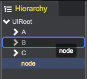

# Hierarchy Panel
  

Project panel acts as asset management to display all usable resources, and Hierarchy panel is for displaying for game objects in current scene, presenting the parent-child relationship of game objects. 

You can select objects in the Hierarchy and drag one object onto another to make use of Parenting (see below). As objects are added and removed in the scene, they will appear and disappear from the Hierarchy as well. 

* Insert as child	 	
  	 
After the drag-and-drop operation, node will become the last child of B. 	

* Insert under node		 
    	
After the drag-and-drop operation, node will under the same parent as B, but behind it: A, B, node, C.  

* Insert above node	 
  
After the drag-and-drop operation, node will under the same parent as B, but front it: A, node, B, C.  	

<video controls="controls" src="../video/drag_node_in_hierachy.mp4"></video>  
