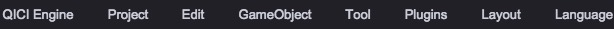

# Main Menu
  
For extending main menu, please reference: [Extending Main Menu](../ExtendEditor/Menu.md)

* __QICI Engine__
	* __About QICI Engine__ - Navigate to http://www.qiciengine.com/
	* __Check for Updates__ - Check for the latest editor updates
	* __Help__ - Navigate to online guides, API documents and forum
	* __Preference__ - Preference Settings for Editor
* __Project__
	* __New Scene__ - Create a new scene
	* __Save Scene__ - Save current scene
	* __Reload Scene__ - Reload current scene
	* __Open Recent__ - Open recent projects
	* __New Project__ - Create a new project
	* __Open Project__ - Select a project to open	
	* __Publish__ - Publish project
	* __Settings__ - Set properties for current project
* __Edit__
	* __Undo__ - Undo the last action
	* __Redo__ - Redo the last action
	* __Cut__ - Cut selected node
	* __Copy__ - Copy selected node
	* __Paste__ - Paste node
	* __Duplicate__ - Copy and paste selected node
	* __Delete__ - Delete selected node
	* __Preview(WebGL)__ - Run game with WebGL mode in another web page
	* __Preview(Canvas)__ - Run game with Canvas mode in another web page
	* __Run__ - Run(or exit running) game
	* __Apply To Prefab__ - Save selected node's changes to associated prefab file
* __GameObject__
	* __Empty Node__ - Create an empty node
	* __Image__ - Create an Image node
	* __Sprite__ - Create a Sprite node
	* __Text__ - Create a Text node
	* __Button__ - Create a Button node
	* __Toggle__ - Create a Toggle node
	* __ScrollBar__ - Create a ScrollBar node
	* __ScrollView__ - Create a ScrollView node
	* __ProgressBar__ - Create a ProgressBar node
	* __Slider__ - Create a Slider node
	* __Input Field__ - Create an Input Field node
	* __Sound__ - Create a Sound node
	* __Dom__ - Create a Dom node
	* __Graphics__ - Create a Graphics node
	* __UIRoot__ - Create an UIRoot node
	* __Tilemap__ - Create a Tilemap node
* __Tool__
	* __Frame Animation Editor__ - Open frame animation editor
	* __Import Assets__ - Open assets import tool
	* __Repack Texture Atlases__ - Repack all texture atlases
	* __Create WebFont__ - Create WebFont assets
* __Plugins__
	* __Plugin Manager__ - Open plugin manager tool
	* __Plugin Store__ - Open online plugin store
	* __Export Plugin__ - Export plugin package
* __Layout__
	* __Portrait__ - Portrait layout
	* __Landscape__ - Landscape layout
* __Language__
    * __中文__ - Switch to Chinese language
    * __English__ - Switch to English language
		