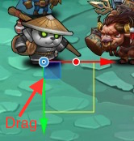
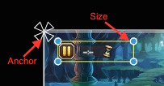

# Scene, Game Panel
  

## Function Description
  * Edit mode for building scene content
  * Play mode for running game   

## Operation
  * There is a white rectangle in scene to indicate the screen bounds   
  * With the functions on the toolbar, you can create an UIImage node, then move it, scale it, change it's anchor. 
    * __Move__  
      
    <video controls="controls" src="../video/oper_move_node.mp4"></video>

    * __Scale__    
      	
    <video controls="controls" src="../video/oper_scale_node.mp4"></video> 

    * __Anchor, Size__    
      	  
    <video controls="controls" src="../video/oper_size_node.mp4"></video>  