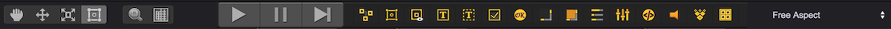
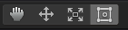
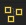
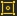
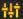
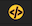
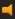

# Toolbar
  

Toolbar's functions can be divided into five sections：
## Transform
   
From left to right:
1. __Pan__ - Move the whole canvas, shortcut key: __Q__
2. __Move__ - Change the coordinate of node, shortcut key: __W__
3. __Scale__ - Change the scale of node, shortcut key: __E__
4. __Anchor and Size__ - Change the anchor and size of node, shortcut key: __R__  

## Accessibility
  
From left to right:
1. Zoom scene to fit content, shortcut key: __T__
2. Show/Hide ruler, shortcut key: __Y__

## Run and Debug
  
From left to right:
1. __Run(Exit running) game__
2. __Pause game__
3. __Stepping debug__

## Add Game Objects
  
From left to right: 
* __Empty Node__  - Create an empty node
* __Image__  - Create an Image node
* __Sprite__  - Create a Sprite node
* __Text__  - Create a Text node
* __Input Field__  - Create an Input Field node
* __Toggle__  - Create a Toggle node
* __Button__  - Create a Button node
* __ScrollBar__  - Create a ScrollBar node
* __ScrollView__  - Create a ScrollView node
* __ProgressBar__  - Create a ProgressBar node
* __Slider__  - Create a Slider node
* __Dom__   - Create a Dom node
* __Sound__  - Create a sound node
* __Tilemap__  - Create a Tilemap node
   
## Change Resolution
  
Choose mainstream mobile phone resolution, for Android, pick up the most close resolution, or choose "Free Aspect" option.    
