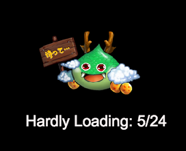
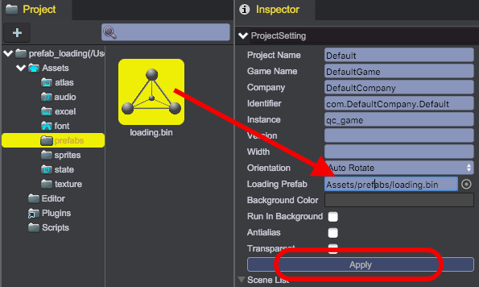

# Loading Screen

Friendly loading screen can help users know current loading progress of game assets, here we make use of the Prefab asset created in [Prefab](../Prefab/index.html) to make game loading screen effect:		
  

## Display Loading Progress
1. Open [Project Settings](../Settings/index.html), set 'Loading Prefab' as Assets/prefabs/loading.bin' in Inspector panel, remember to click 'Apply' button.	
 
2. Add 'Tween/TweenAlpha' component on 'loading' node, and set Duration as 1 in Inspector panel:	
 	
3. Add 'LoadingUI.js' script on 'loading' node, set clue property reference to '%' node:	
 	

````javascript
var LoadingUI = qc.defineBehaviour('qc.demo.LoadingUI', qc.Behaviour, function() {
    this.clue = null;
}, 
{
    clue: qc.Serializer.NODE
});

LoadingUI.prototype.awake = function() {
    var self = this;
    // Show Prefab instance on loading start
    self.game.state.onStartLoad.add(function() {            
        self.show();
    });
    // Hide Prefab instance on loading finish
    self.game.state.onEndLoad.add(function() {            
        if (self.gameObject.visible) { 	        	
            var tweenAlpha = self.gameObject.getScript('qc.TweenAlpha');                
            if (tweenAlpha.enable) {
            	// if tween is enable, 
            	// set _hideOnFinished flag to hide it when tween is finished            	
                tweenAlpha._hideOnFinished = true;
            }
            else {
                self.hide();    
            }                
        }
    });
};

LoadingUI.prototype.update = function() {
    var self = this,
        loaded = self.game.assets.loaded,
        total = self.game.assets.total;

	// update loading progress text
    self.clue.text = 'Hardly Loading: ' + loaded + '/' + total;

    // move Prefab instance to the top, in case it is covered by real game objects.
    var parent = self.gameObject.parent;
    parent.setChildIndex(this.gameObject, parent.children.length - 1);
};

// Show Prefab
LoadingUI.prototype.show = function() {
    var self = this, tweenAlpha = self.gameObject.getScript('qc.TweenAlpha');
    self.gameObject.alpha = 0;
    self.gameObject.visible = true;
    tweenAlpha.from = 0;
    tweenAlpha.to = 1;
    tweenAlpha.stop();  
    tweenAlpha.resetToBeginning(); 
    tweenAlpha.onFinished.addOnce(function() {
        if (tweenAlpha._hideOnFinished) {
            tweenAlpha._hideOnFinished = false;
            self.gameObject.visible = false;                    
        }            
    });             
    tweenAlpha.playForward();
 
};

// Hide Prefab
LoadingUI.prototype.hide = function() {
    var self = this, tweenAlpha = self.gameObject.getScript('qc.TweenAlpha');
    self.gameObject.alpha = 1;
    tweenAlpha.from = 1;
    tweenAlpha.to = 0;
    tweenAlpha.stop();
    tweenAlpha.resetToBeginning();         
    tweenAlpha.onFinished.addOnce(function() {            
        self.gameObject.visible = false;
    });
    tweenAlpha.playForward();
};
````
## Scene Switching

From the source code of HTML page that run game, you can see the Prefab instance's ignoreDestroy property is set as true, so even after switching scene, the Prefab instance is still in the scene, just being displayed when swithing scene, after that it's hidden. 

So for demonstrating loding screen on scene switching, all we need to do now is just create some scenes, and provide an action to trigger scene switching.

We create RedState, YellowState and BlueState scenes, each one with a corresponding color background and a button for next scene, all the buttons share the same NextState.js script:		

````javascript
var NextScene = qc.defineBehaviour('qc.demo.NextScene', qc.Behaviour, function() {
    this.scene = '';
}, 
{
    scene: qc.Serializer.STRING
});
NextScene.prototype.onClick = function() {
	this.game.state.load(this.scene);        
};
````
 	

## Demo
[Prefab Demo](http://engine.qiciengine.com/demo/Prefab/prefab_loading/index.html)   
