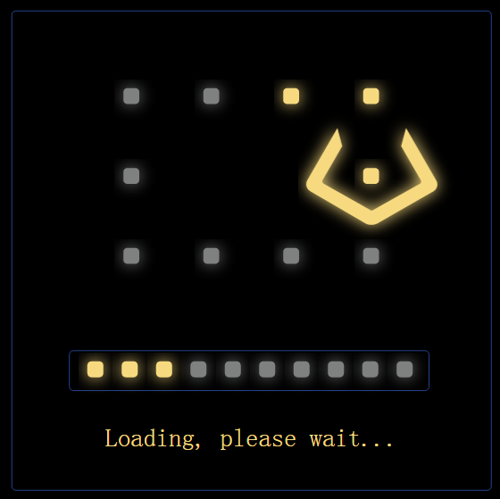

# Loading Window During Booting 
When [loadingPrefab](loadingPrefab.md) is set, the boot loading window will wait for all javascript files and the first scene's resources loaded.  
When [loadingPrefab](loadingPrefab.md) isn't set, the boot loading window will only wait for all javascript files loaded. The [loadingPrefab](loadingPrefab.md) will be showed to wait for the first scene's resources loaded.   

## Build-in Loading Window    
QICI Editor supports three build-in loading window:    
1. Eating Beans, see the following picture:    
	   
	The loading window is the default loading window, it uses svg to animate. In the entry html file, if qici.config.loadingHandler variable is 'svgHandler', this loading window is enabled.   
	
2. Progress, see the following picture:    
	   
	In the entry html file, if qici.config.loadingHandler variable is 'progressHandler', this loading window is enabled.  
	
3. Static Background, see the following picture:    
	   
	In the entry html file, if qici.config.loadingHandler variable is 'backgroundHandler', this loading window is enabled.  
	The background can be set throught qici.config.loading.backgroundStyle variable, for example:  
		loadingHandler: 'backgroundHandler',
        loading: {
			backgroundStyle: "background-image:url(../../build/imgs/qici.png);background-size:100% 100%",
		}
	
## Customize Loading Window    
1. Create a javascript file, such as testLoading.js. In this file, define a class, such as testHandler, the class must impletement the three methods:   
     a. void start(totalAssetCount) : When start loading, this method will be invoked with total asset's count parameter.    
     b. void progress(curCount) : When one asset is loaded, this method will be invoked with current asset's count parameter.     
     c. void finish() : When all assets are loaded, this method will be invoked.    
	 
2. Instantiate the above class, then set to qici.loadingHandler variable. Such as: qici.loadingHandler = new testHandler();      

3. In the entry html file, set the name of custom loading handler to qici.config.loadingHandler. Such as: qici.config.loadingHandler = 'testHandler';  
	  
4. In the entry html file, add the custom script after qc-loading.js in html file. Such as:    
		<body onload="qici.init();">
			

				

				

			

			
			
		</body>  
		
## Demo  
Please see backgroundHandler, progressHandler and svgHandler class in the qc-loading-debug.js file.  

      
