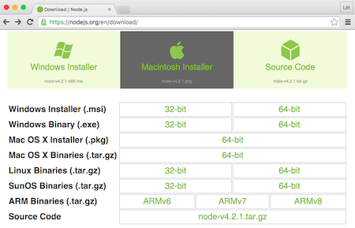
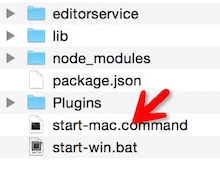
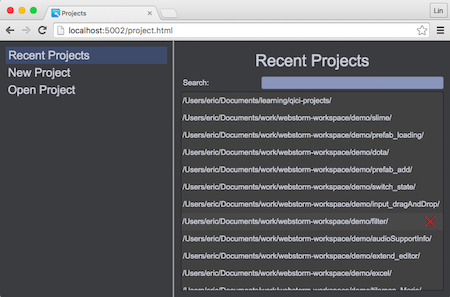

# Installation on Mac OS X

## Install [Node.js](https://nodejs.org)
[Download Node.js installer](https://nodejs.org) for your platform，follow the instructions to install it.	
    
If you already have Node.js installed, please update it to latest version. the Node.js versions that QICI Engine supports are:	
1. Any v0.12.x version before [io.js](https://iojs.org) merged with Node.js
2. Any version higher than v4.1 after [io.js](https://iojs.org) merged with Node.js 

## Download QICI Engine	
Download QICI Engine noinstall zip from [GitHub](https://github.com/qiciengine/qiciengine/tree/master/releases), and unzip it. 

## Run QICI Engine
Double click on start-mac.command to start QICI Engine server, then QICI Editor will be open in browser automatically:	
  
  

* In unzip folder, you can also start QICI Engine server by command: node ./editorservice/StartService.js
* QICI Editor can run on any browser that supports HTML5, but we recommand you to use Google Chrome browser for better performance
* The entry url of QICI Editor is: http://localhost:port/project.html, you can get the port value from server console:	  
    

