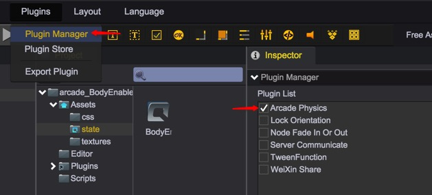
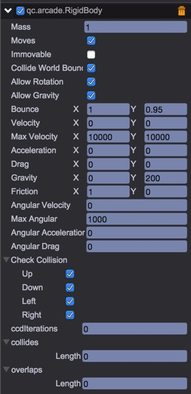

# Arcade Physics

QICI engine currently uses Arcade as physical system, and made some optimization for better performance.

## Enable Arcade Physics

Arcade Physics has been integrated in QICI editor as a built-in plugin. To enable the plugin, just open PluginManager panel through menu Plugins->PluginManager, and check the Arcade Physics option. 
 

## RigidBody

Adding a RigidBody component to an object will put its motion under the control of Arcade physics system, such as gravity, collision, drag etc.    
Notice: Only UIImage and Sprite can attach RigidBody component currently.  
Notice: We made some restrictions in the use of RigidBody, just comply to these two points:
* Rotation set to rigidbody and it's parent node is not allowed.
* Movement applied to rigidbody's parent node is not allowed.

 

### mass
The mass of the rigibody, when two rigidbodies collide their mass is used in the calculation to determine the exchange of velocity. 

````javascript
    var rigidbody = self.sprite1.getScript("qc.arcade.RigidBody");

    // set mass of the rigidbody
    rigidbody1.mass = 100;
````

### moves
Whether allow the physics system to move this rigidbody. 
````javascript
    // allow physics system to control the position of rigidbody
    rigidbody.moves = true;
````

### immovable
Whether this rigidbody will not receive any impacts from other rigidbodies. 
````javascript
    rigidbody.immovable = true;
````

### collideWorldBounds
Should the rigidbody collide with the world bounds? A RigidBody can be set to collide against the World bounds automatically and rebound back into the world if this is set to true. Otherwise it will leave the World.

````javascript
    rigidbody.collideWorldBounds = true;
````

### allowGravity
Allow this rigidbody to be influenced by gravity?

### gravity
The local gravity setting of the rigidbody. Defaults to x: 0, y: 0

````javascript
    // set influenced by gravity
    rigidbody.allowGravity = true;

    // set local gravity to (x:0, y:200)
    rigidbody.gravity.x = 0;
    rigidbody.gravity.y = 200;
````

### bounce
The elasticity of the rigidbody when colliding, bounce.x/y = 1 means full rebound, bounce.x/y = 0.5 means 50% rebound velocity. 

````javascript
    // 50% rebound when colliding
    rigidbody.bounce.x = 0.5;
    rigidbody.bounce.y = 0.5;
````

### vilocity
Velocity of the rigidbody.

### acceleration
The rate of change of the velocity.

### drag
The drag applied to the motion of the rigidbody.

````javascript
    rigidbody.vilocity.x = 100;
    rigidbody.vilocity.y = 50;

    rigidbody.acceleration.x = 10;
    rigidbody.acceleration.y = 5;

    rigidbody.drag.x = 5;
    rigidbody.drag.y = 5;
````

### allowRotation
Allow this rigidbody to be rotated?

### angularVelocity
The rotation speed of the rigidbody. Measured in radians per second. 

### angularAcceleration
The rate of change of the angular velocity.

### angularDrag
The drag applied to the rotation of the rigidbody.

````javascript
    // allow the rigidbody to rotate
    rigidbody.allowRotation = true;

    // set angular speed
    rigidbody.angularVelocity = 20;

    // set angular acceleration when rotation
    rigidbody.angularAcceleration = 5;

    // set drag when rotation
    rigidbody.angularDrag = 1;
````

### checkCollision
Which directions collision is processed for this rigidbody.
````javascript
    rigidbody.checkCollision.up = true;
    rigidbody.checkCollision.down = true;
    rigidbody.checkCollision.left = true;
    rigidbody.checkCollision.right = true;
````

### ccdIterations
Number of discrete points for continuous collision detection, used to prevent fast moving objects from passing through other objects without detecting collisions. Higher ccdIterations value means better physical collision, however the greater performance overhead.

## Video
<video controls="controls" src="../video/plugin_arcade.mp4"></video>

## API
[RigidBody API](http://docs.qiciengine.com/api/officialplugins/arcade/RigidBody.html)

## Demo
[AccelerateToPoint](http://engine.qiciengine.com/demo/ArcadePhysics/arcade_AccelerateToPoint/index.html)   
[AngleBetween](http://engine.qiciengine.com/demo/ArcadePhysics/arcade_AngleBetween/index.html)  
[AngularAcceleration](http://engine.qiciengine.com/demo/ArcadePhysics/arcade_AngularAcceleration/index.html)  
[AngularVelocity](http://engine.qiciengine.com/demo/ArcadePhysics/arcade_AngularVelocity/index.html)  
[AsteroidsMovement](http://engine.qiciengine.com/demo/ArcadePhysics/arcade_AsteroidsMovement/index.html)  
[BodyEnable](http://engine.qiciengine.com/demo/ArcadePhysics/arcade_BodyEnable/index.html)  
[BodyScale](http://engine.qiciengine.com/demo/ArcadePhysics/arcade_BodyScale/index.html)  
[BounceAcceleration](http://engine.qiciengine.com/demo/ArcadePhysics/arcade_BounceAcceleration/index.html)  
[BounceKnock](http://engine.qiciengine.com/demo/ArcadePhysics/arcade_BounceKnock/index.html)  
[OnCallback](http://engine.qiciengine.com/demo/ArcadePhysics/arcade_OnCallback/index.html)  