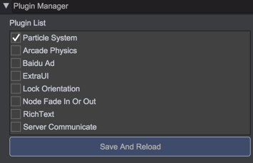
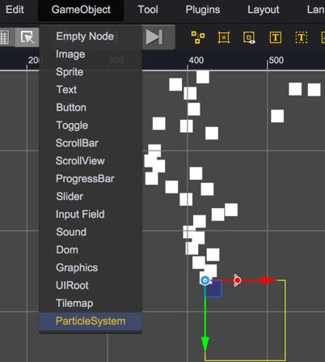
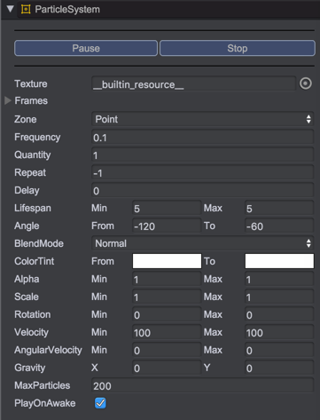
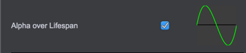
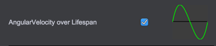

# Particle System

Particle System in QICI can be used to simulate smoke, fire, explosion and other atmospheric effects (such as rain and snow etc.). Through Particle System, we can simulate these above-mentioned effects even use a small number of pictures.

# Enable Particle System

Particle System has been integrated in QICI as a built-in plugin. To enable the plugin, just open PluginManager panel through menu Plugins->PluginManager, and check the 'Particle System' option.  
   

# Create a Particle System

You can create a new particle system by creating a Particle System GameObject (menu GameObject -> Particle System).  
   

# The Particle System Inspector
Select the particle system object in the scene, you can view the properties through the inspector panel, modify them and preview. It looks like this:   
     

## Texture
The texture that particles will use, support the following types: 
* A frame in atlas, then all particles will use the same frame.
* The whole atlas, then particles will use random frame of atlas.
* Normal texture with sprite sheet data, then particles will use relative frame according to sprite sheet data, see Sprite Sheet Animation module.

## Zone
The shape of the emission zone. Currently supports four types: Zone.POINT(point), Zone.LINE(line), Zone.CIRCLE(circle) and Zone.RECTANGLE(rectangle).

## EdgeEmission
Whether the particles will be emitted from the edge of the zone.

## EmissionSpace
The emission space. Currently support two types: EmissionSpace.WORLD and EmissionSpace.LOCAL.
* If set to EmissionSpace.WORLD, the emitted particles will not affected by particle system node.

## Frequency
How often per emission, in seconds. 

## Quantity
How many particles will be generated per emission.

## Repeat
The repeat count of emission, -1 means loop always.

## Delay
The delay time of the first emission in seconds.

## Lifespan
How long each particle lives once it is emitted in seconds.

## Angle
The emission angle of particles, the value is picked at random within specified min-max range.

## BlendMode
The blend mode of particle.

## StartColor
The start color of particle.

## StartColorVariation
The variable of start color.

## EndColor
The end color of particle.

## EndColorVariation
The variation of end color.

## StartAlpha
The transparency of particles, the value is picked at random within specified min-max range.

## StartScale
The start scale of particles, the value is picked at random within specified min-max range.

## StartRotation
The start rotation of particles, the value is picked at random within specified min-max range.

## StartVelocity
The start velocity of particles, the value is picked at random within specified min-max range.

## AngularVelocity
The start angular velocity of particles, the value is picked at random within specified min-max range.

## Gravity
The gravity of particle systems.

## MaxParticles
The maximum number of particles, the emission will be stopped when the number of particles exceeds this value.

## PlayOnAwake
Whether the particle system will start playing automatically. If set to false, we need call relative method manually for emitting particles.(see [ParticleSystem API](http://docs.zuoyouxi.com/api/officialplugins/particleSystem/CParticleSystem.html))

# Sprite Sheet Animation Module
  
Through this module, we can configurate the frame animation of particles.
* InitialFrame: The initial frame of particle's frame animatio.
* FrameRate: The frame rate of particle's frame animation.
Node: This module will only take effect when the texture property is set to normal texture with sprite sheet data.

# Color Control Module  
    
If enable this module, we can control the color change of each particle in the lifespan through a curve. If this module is off, the particle color will vary linearly between startColor and endColor.

# Alpha Control Module   
   
If enable this module, we can control the transparency change of each particle in the lifespan through a curve.   
Note: If the transparency of the particle remains unchanged, this module should be turned off for better performance.

# Scale Control Module    
   
If enable this module, we can control the scale change of each particle in the lifespan through a curve.   
Note: If the scale of the particle remains unchanged, this module should be turned off for better performance.

# Velocity Control Module    
   
If enable this module, we can control the velocity change of each particle in the lifespan through a curve.   
Note: If the velocity of the particle remains unchanged, this module should be turned off for better performance.

# Angular Velocity Control Module    
   
If enable this module, we can control the angular velocity change of each particle in the lifespan through a curve.   
Note: If the angular velocity of the particle remains unchanged, this module should be turned off for better performance.

## API
[ParticleSystem API](http://docs.qiciengine.com/api/officialplugins/particleSystem/CParticleSystem.html)

## Demo
[ParticleSystem Demos](http://engine.qiciengine.com/demo/index.html#anchor_ParticleSystem)  
