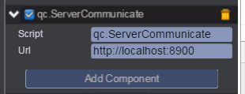

# Server Commnunication
It supports network communication between front-end and server. It contains http and websocket communication. It only be availabe while [simple server](server.html) is booted.

## Plugin Pannel
   
   
Url : server address

Add this plugin to any node, then we can communicate with server throught this node.

## Http Communication
* Using POST to send data
* POST url is composed of url in pannel and "/cmd"
* contentType is application/json;charset=UTF-8		

Data Package is following:
````
POST http://localhost:8900/cmd HTTP/1.1
Host: localhost:8900
Proxy-Connection: keep-alive
Content-Length: 14
Cache-Control: no-cache
Origin: chrome-extension://gigaangkijllnhikjjhfmpjkddjphlie
User-Agent: Mozilla/5.0 (Windows NT 6.1; WOW64) AppleWebKit/537.36 (KHTML, like Gecko) Chrome/47.0.2526.8 Safari/537.36
Content-Type: application/json
Accept: */*
Accept-Encoding: gzip, deflate
Accept-Language: zh-CN,zh;q=0.8

{"cmd":"TEST"}
````

## Websocket Communication  
Using socket.io libary to impletment websocket. Please see http://socket.io/  

## Http API
* sendMessage(node, cmd, jsonData, resCallback)		
Send custom http message to server.  

| Parameter | Type | Description |  
| ------------- | ------------- | -------------|  
| node | qc.Node | A node that has this plugin. |  
| cmd | string | Command name |  
| jsonData | json | Command para data in json format |  
| resCallback | function | Callback function, prototype: resCallback(json), json is responsed data in json format. |  

* login(node, username, password, authInfo, resCallback)
Send http login command to server. It will invoke sendMessage(node, 'LOGIN' ....) to send message internally.		

| Parameter | Type | Description |  
| ------------- | ------------- | -------------|  
| node | qc.Node | A node that has this plugin |  
| username | string | User name or account |  
| password | string | User password. It will be crypted during network transform. |  
| authInfo | json | Auth information if needed during login, in json format. |  
| resCallback | function | Callback function, prototype: resCallback(json), json is responsed data in json format. |  

* logout(node, username, password, authInfo, saveData, resCallback)		
Send http logout command to server. It will invoke sendMessage(node, 'LOGOUT' ....) to send message internally.	

| Parameter | Type | Description |  
| ------------- | ------------- | -------------|  
| node | qc.Node | A node that has this plugin |  
| username | string | User name or account |  
| password | string | User password. It will be crypted during network transform. |  
| authInfo | json | Auth information if needed during login, in json format. |  
| saveData | json | User data that need to save, in json format. |   
| resCallback | function | Callback function, prototype: resCallback(json), json is responsed data in json format. |  

## Socket API  
* registerSocketCmd(node, cmd, func)	
Register handler for socket command.	

| Parameter | Type | Description |  
| ------------- | ------------- | -------------|  
| node | qc.Node | A node that has this plugin |  
| cmd | string | Command name |  
| func | function | Command handler. The prototype is: function(node, ...) |  

* socketConnect(node, [opts])		
Connect to a socket server.

| Parameter | Type | Description |  
| ------------- | ------------- | -------------|   
| node | qc.Node | A node that has this plugin |  
| opts | mapping | Optional parameter. See opts in socket.io  |    

* sendSocketMessage(node, cmd, ...)		
Send socket message to socket server.   

| Parameter | Type | Description |  
| ------------- | ------------- | -------------|  
| node | qc.Node | A node that has this plugin |  
| cmd | string | Command name |  
| ... | array | Optional parameters.  |  
The return value is true when success, else return false.

## Socket Event  
* onConnect	 
The event for new connection.    
The prototype is: function(node)    

* onDisconnect	 
The event for connection lost.   
The prototype is: function(node)  
 
* onError	
The event for connection error.   
The prototype is: function(node, err)   

## Http Example
````javascript
	// send custom message
	qc.ServerCommunicate.sendMessage(this.gameObject, "TEST", {"data":"test"}, callback);
	
	// login
	qc.ServerCommunicate.login(this.gameObject, "testuser", "testpassword", {}, callback);
	
	// logout
	qc.ServerCommunicate.login(this.gameObject, "testuser", "testpassword", {}, {"data":"savedata"}, callback);
````


## Websocket Example
````javascript
	// register command handler
	qc.ServerCommunicate.registerSocketCmd(this.gameObject, 'MSG_TEST_SOCKET', function(socketNode, para1, para2, para3){
        console.log(socketNode, para1, para2, para3);
    })

    // connect socket server
    qc.ServerCommunicate.socketConnect(this.gameObject);
	
	// After socket connected, we can send command to server like this
    qc.ServerCommunicate.sendSocketMessage(this.gameObject, 'TEST_SOCKET', 'para1', 2, { value : 'test'} );  
````

## Demo
[ServerCommunicate Demo](http://engine.qiciengine.com/demo/Net/serverCommunicate/index.html)

[simple server](server.html) need to be booted while running this demo.