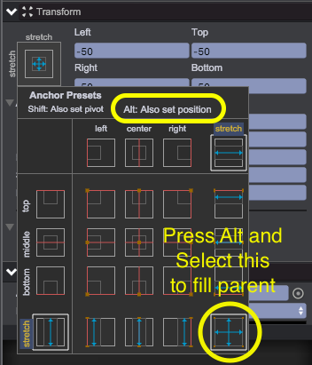
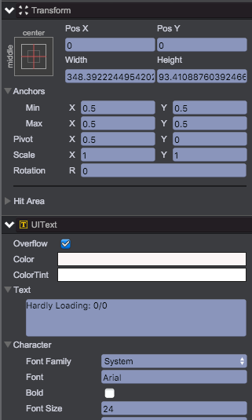
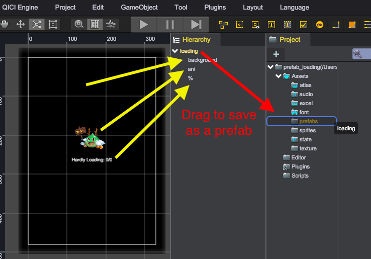

# Prefab

## Function of Prefab
It is convenient to build a game object in the scene by adding components and setting their properties to appropriate values. This can be a problem, however, when you need to create several same properties game objects to be reused in the scene.

Fortunately, QICI Engine has a Prefab asset type that allows you to store a game object complete with components, properties and all descendants. The Prefab acts as a template from witch you can create new object instance in the scene.

## Prefab Creating
Game loading progress UI is always needed to be reused in switching scenes, here we create a prefab_loading sample to demostrate the creating of Prefab.

1. Create an UIRoot instance named 'loading', UIRoot will fill the screen size automatically.
2. Create an UIImage instance named 'background', setting background as black and fill its parent.	
	
Click the top-left button on Transform panel, press 'Alt' key and select the bottom-right button to fill its parent.	
	
3. Create a Sprite instance named 'ani', configure skeleton animation, set anchor to the center of its parent and adjust the Sprite's display position above the middle.	
	
4. Create a UIText instance named '%', use it for displaying progress of loading assets, set anchor to the center of its parent, set pivot to top-center position.	
	
5. Drag 'loading' node to Assets/Prefabs folder for saving as loading.bin Prefab asset.	
	

<video controls="controls" src="../video/create_prefab.mp4"></video>

## Prefab Using
The most simplest way to use Prefab is dragging Prefab asset to drop on the game object in Hierarchy panel, Another way is to write code as below:

````javascript
G.game.assets.load('loadingPrefab', 'Assets/prefabs/loading.bin', function(asset) {
    var node = G.game.add.clone(asset);
});
````
You can also use G.game.assets.find('loadingPrefab'); to get loaded assets:

````javascript
G.game.assets.load('loadingPrefab', 'Assets/prefabs/loading.bin', function(asset) {
    var prefabAsset = G.game.assets.find('loadingPrefab');
    var node = G.game.add.clone(prefabAsset);
});
````
The code above can be run in the browser console, The 'G' is the global variable of QICI Editor for debugging conveniently.

## Prefab Editing

The game object created from Prefab asset will be displayed with blue label in Hierarchy panel, after modify it in scene, you can select it and click 'Apply Prefab' button in Inspector panel to save all the changes to related Prefab asset file.	


Alternative way to edit Prefab is by double clicking on the Prefab asset, game objects in current scene will be hidden, new game object will be created from Prefab template automatically. Then you can edit the game object, after modification you can click 'save' button to save all the changes to related Prefab asset file, or click 'cancel' to cancel the editing, then the original game objects in the scene will be visible again, and game obect created from Prefab template will be deleted automatically.	


## Demo
[Prefab Demo](http://engine.qiciengine.com/demo/index.html#Prefab)
