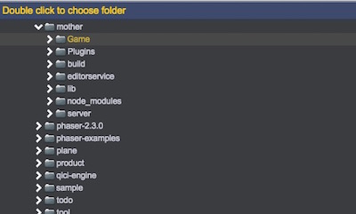
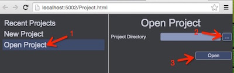

# Project Management

## Create a New Project
1. Select 'New Project':	
    
2. Navigate to an empty directory that you want to create your project, and double click it:	
    
3. Click 'Create' to initialize the new project   
    

<video controls="controls" src="../video/create_project.mp4"></video>

## Open Project
1. Select 'Open Project':	
2. Navigate to the project directory to open it:	
    

<video controls="controls" src="../video/open_project.mp4"></video>  

__Note: If you want to open multiple projects at the same time, please start mulitple servers__	 

## Switch Project
In QICI Editor, select 'Project/Open Recent' in main menu to choose the project name that your want to switch to:	
    

<video controls="controls" src="../video/switch_project.mp4"></video>  
  