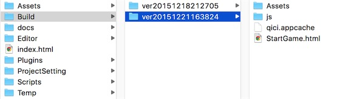

# Publishing
1. Set project information correctlly, see [Project Settings](../Settings/index.html):		
  * Make sure correct 'Identifier' value
  * Make sure correct 'Version' value
  * Make sure all the scenes that need to be published are checked, and set the correct entry scene  
2. Click 'Project/Publish...' from main menu to publish
3. Wait for a moment, content described below will appear in the 'Build' folder of the project:	
  * Assets/: All the assets in the project
  * js/：The packed and minified JavaScript
  * qici.appcache：A manifest file for [Application Cache](https://developer.mozilla.org/en-US/docs/Web/HTML/Using_the_application_cache). If [Application Cache](https://developer.mozilla.org/en-US/docs/Web/HTML/Using_the_application_cache) is enable in [Project Settings](../Settings/index.html), this file will be generated in publish.  
  * StartGame.html：The start HTML page of game, you can customize it
    
4. Upload all the stuffs to website server, then you can play the game by visit StartGame.html.

