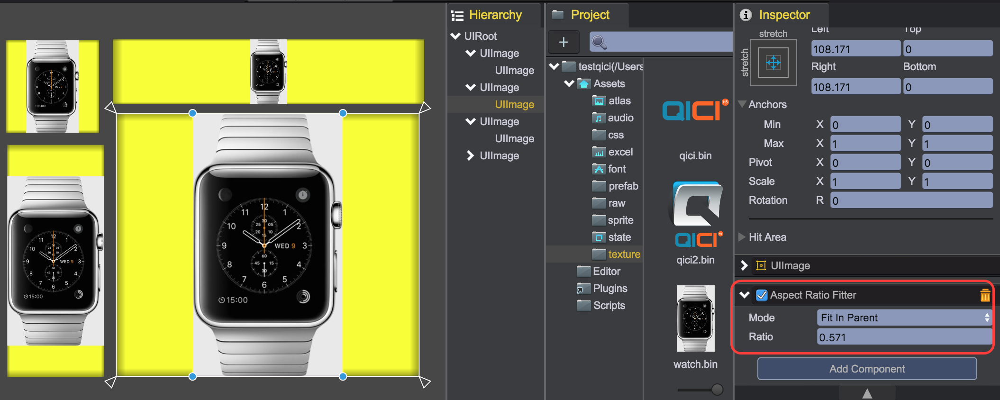

# AspectRatioFitter
The qc.AspectRatioFitter script is used to keep the aspect radio of the game object. It can adjust the height to fit the width or vice versa, or it can make the game object fit inside its parent or envelope its parent.

## Radio
The aspect ratio to enforce. This is the width divided by the height.
````javascript
aspectRatioFitter.ratio = 296 / 528;
````

## WIDTH_CONTROLS_HEIGHT
The height is automatically adjusted based on the width.
````javascript
aspectRatioFitter.mode = qc.AspectRatioFitter.WIDTH_CONTROLS_HEIGHT;
````

## HEIGHT_CONTROLS_WIDTH
The width is automatically adjusted based on the height.
````javascript
aspectRatioFitter.mode = qc.AspectRatioFitter.HEIGHT_CONTROLS_WIDTH;
````

## FIT_IN_PARENT
The width, height, position, and anchors are automatically adjusted to make the rect fit inside the rect of the parent while keeping the aspect ratio. The may be some space inside the parent rect which is not covered by this rect.
````javascript
aspectRatioFitter.mode = qc.AspectRatioFitter.FIT_IN_PARENT;
````

## ENVELOPE_PARENT
The width, height, position, and anchors are automatically adjusted to make the rect cover the entire area of the parent while keeping the aspect ratio. This rect may extend further out than the parent rect.
````javascript
aspectRatioFitter.mode = qc.AspectRatioFitter.ENVELOPE_PARENT;
````

## NONE
Disable the AspectRatioFitter's function.
````javascript
aspectRatioFitter.mode = qc.AspectRatioFitter.NONE;
````

## Sample
````javascript
var aspectRatioFitter = node.addScript('qc.AspectRatioFitter');
aspectRatioFitter.ratio = 296 / 528;
aspectRatioFitter.mode = qc.AspectRatioFitter.FIT_IN_PARENT;
````


## API
[AspectRatioFitter API](http://docs.qiciengine.com/api/components/AspectRatioFitter.html)

## Demo
[AspectRatioFitter Demo](http://engine.qiciengine.com/demo/Layout/aspect_ratio_filter/index.html)
