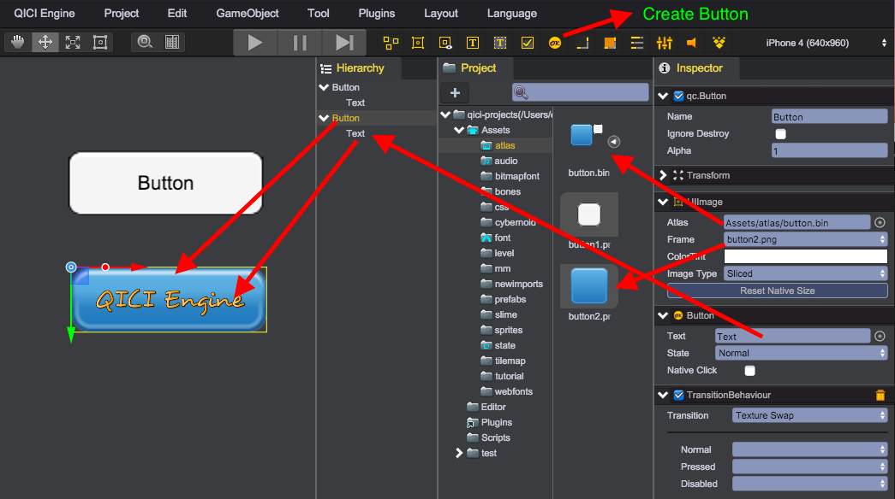

# Button
The qc.Button component responds to a click from the user.  


## Create Button
Create Button object from main menu(GameObject/Button) or toolbar
````javascript
node = game.add.button(parent);
````

## Button Composition

* Button  
qc.Button inherit from [qc.UIImage](UIImage.html), so a Button object has all features that UIImage has. Button's interactive property is true by default.

* Text  
By default, the Button object has an UIText object for displaying text, if you don't need text content, just remove or hide the UIText object. You can reference to the UIText object from button.text.
````javascript
// Set the text content
node.text.text = 'Start';
// Set the font size
node.text.fontSize = 16;
````

## State
Button has a state property that can be in 3 types of values as below:
* qc.UIState.NORMAL - The normal state
* qc.UIState.PRESSED - The pressed state
* qc.UIState.DISABLED - The state that the button will not respond to input
````javascript
// Set the button as disabled state
node.state = qc.UIState.DISABLED;
````

## TransitionBehaviour
By default, the button will add a qc.TransitionBehaviour script internally, that will change the button's display effect according to state.
````javascript
// Get the TransitionBehaviour script
tb = button.getScript('qc.TransitionBehaviour');
````

* NONE  
Do nothing when state changed
````javascript
tb.transition = qc.Transition.NONE;
````

* COLOR_TINT  
Change colorTint value according to state  

````javascript
tb.transition = qc.Transition.COLOR_TINT;
// The colorTint value in normal state
tb.normalColor = new qc.Color(0xffffffff);
// The colorTint value in pressed state
tb.pressedColor = new qc.Color(0xffcccccc);
// The colorTint value in disabled state
tb.disabledColor = new qc.Color(0xffcccccc);
````

* TEXTURE_SWAP  
Change frame value according to state  

````javascript
tb.transition = qc.Transition.TEXTURE_SWAP;
// The frame value in normal state
tb.normalTexture = 'button1';
// The frame value in pressed state
tb.pressedTexture = 'button2';
// The disabled value in pressed state
tb.disabledTexture = 'button2';
````

## Listen to Click Event

* Solution 1: Add a behaviour script on the button, and implement the onClick method:

````javascript
var ButtonHandler = qc.defineBehaviour('qc.demo.ButtonHandler', qc.Behaviour, function() {

},
{
    // The fields need to be serialized
});

// Called when the button is clicked
ButtonHandler.prototype.onClick = function() {
    // The stuffs that you want to do when the button is clicked
};
````

* Solution 2: In other behaviour script, add a property that is serializable and reference to the button.

````javascript
var OtherHandler = qc.defineBehaviour('qc.demo.OtherHandler', qc.Behaviour, function() {
	this.btn = null;
},
{
    // The fields need to be serialized
    btn: qc.Serializer.NODE
});
OtherHandler.prototype.awake = function() {
	// Add a listener for click event
	this.addListener(this.btn.onClick.add, this.onBtnClick, this);
};

OtherHandler.prototype.onBtnClick = function() {
	// The stuffs that you want to do when the button is clicked
};
````


<video controls="controls" src="../video/oper_button.mp4"></video>  

## Button API
[Button API](http://docs.qiciengine.com/api/gameobject/CButton.html)

## Button Demo
[Button Demo](http://engine.qiciengine.com/demo/index.html#anchor_Button)
