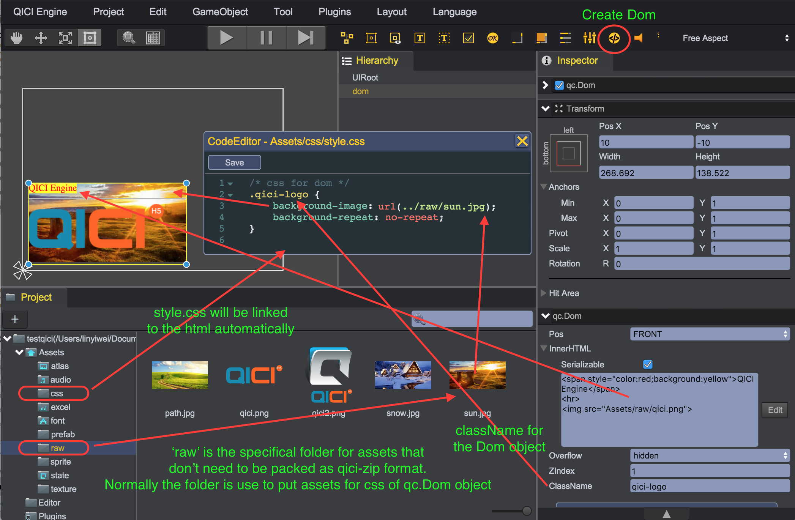

# Dom
qc.Dom is represented as a div element, it has all the features of HTML element. It doesn't need to be rendered every single frame, so using qc.Dom will has much better rendering performance.

## Layers
Dom's div element can be displayed above game.canvas or below game.canvas. When above game.canvas, the div is added to game.world.frontDomRoot element; when below game.canvas, the div is added to game.world.backDomRoot element. Only when game.canvas is transparent, the Dom below it will be visible, see [Project Settings](../Settings/index.html)
````
	|
	|--- game.world.frontDomRoot (div)
	|
	|--- game.canvas (canvas)
	|
	|--- game.world.backDomRoot (div)
	|
game.container (div normally)
````

## Assets
By default, QICI editor will pack raw assets(like image, json files, .etc) to zip format file with suffix .bin, when the game [project is published](../Publish/index.html), only .bin files will be published, the raw assets will be discarded.

But for Dom, mostly of the time we need browser to feach the raw assets, so QICI editor treat Assets/raw as a specifical floder, the content in the floder will not be packed, and will be published as what it is.

## CSS
The Assets/css floder floder has a style.css file, it will be linked to the html for starting the game automatically. You can set the className of Dom in Inspector panel, and then define the css effect in style.css file.

## Create Dom object programmly
````javascript
// Create a Dom object
var dom = game.add.dom();

// Set the innerHTML content of the Dom object's div
dom.div.innerHTML = '';

// Set the style for the div
dom.div.style.color = 'red';
dom.div.style.padding = '10px';

// Append child for the div
var subDiv = document.createElement('div');
dom.div.appendChild(subDiv);
````

## Create Dom object by editor


### Pos
The pos properties determine the Dom is displayed above or below the game.canvas:
* qc.Dom.POS_FRONT: Above the game.canvas
* qc.Dom.POS_BACK: Below the game.canvas

````javascript
node.pos = qc.Dom.POS_FRONT
````

### InnerHTML
The div.innerHTML property. The Serializable value determine the innerHTML content to be saved or not. If you initilize the div's content in script dynamically, then you can unchecked Serializable option.
````javascript
node.innerHTML = 'QICI Engine';
node.serializable = true;
````

### Overflow
The div.style.overflow property, valid values: visible, scroll, hidden and auto.
````javascript
node.overflow = 'hidden';
````

### ZIndex
The div.style.zIndex property. Greater than 0 when above game.canvas, less than 0 when below 0.
````javascript
node.zIndex = 1;
````

### ClassName
The div.className property
````javascript
node.className = 'qici-logo';
````

## Video
<video controls="controls" src="../video/oper_dom.mp4"></video> 

## API
[Dom API](http://docs.qiciengine.com/api/gameobject/CDom.html)

## Demo
[DOM Demo](http://engine.qiciengine.com/demo/index.html#anchor_Dom)
