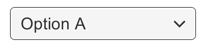

# Dropdown

The Dropdown(qc.Dropdown) can be used to let the user choose a single option from a list of options.  

The control shows the currently chosen option. Once clicked, it opens up the list of options so a new option can be chosen. Upon choosing a new option, the list of options closed again, and the control shows the new selected option. The list is also closed if the use clicks on the control itself, or anywhere else inside the Canvas.  

    
  A Dropdown.      

    
  A Dropdown with its list of options open.      

## Inspector Properties
  

* **Caption Image**: The Image component to hold the image of the currently selected option. (Optional)
* **Caption Text**: The Text component to hold the text of the currently selected option. (Optional)
* **Item**: The component to hold option of the item.
* **Template**: The node of the template for the dropdown list. See instructions below.
* **Options**: The list of possible options. A text string and an image can be specified for each option.

## Details
The list of options is specified in the Inspector or can be assigned from code. For each option a text string can be specified, and optionally an image as well.  

The button has a single event called On Value Changed that responds when the user completes a click on one of the options in the list. It supports sending an integer number value that is the index of the selected option. 0 is the first option, 1 is the second, and so on.  

### The template system
The Dropdown control is designed to have a child Node which serves as a template for the dropdown list that is shown when clicking the dropdown control. The template Node is inactive by default, but can be made active while editing the template to better see what’s going on. A reference to the template object must be specified in the Template property of the Dropdown component.  

The template must have a single item in it. When the actual dropdown list is created upon clicking the dropdown control, this item is duplicated multiple times, with one copy used for each option in the list.   
The template can be setup in many different ways. The setup used by the **GameObject > Dropdown** menu item includes a scroll view, such that if there are too many options to show at once, a scrollbar will appear and the user can scroll through the options. This is however not a mandatory part of the template setup.  

### Placement of the dropdown list
The placement of the dropdown list in relation to the dropdown control is determined by the anchoring and pivot of the Rect Transform of the Template.  

By default, the list will appear below the control. This is achieved by anchoring the template to the bottom of the control. The pivot of the template also needs to be at the top, so that as the template is exapanded to accommodate a variable number of option items, it only expands downwards.  

The Dropdown control has simple logic to prevent that the dropdown is displayed outside the bounds of the Canvas, since this would make it impossible to select certain options. If the dropdown at its default position is not fully within the Canvas rectangle, its position in relation to the control is reversed. For example, a list that is shown below the control by default will be shown above it instead.  

This logic is quite simple and has certain limitations. The dropdown template needs to be no larger than half the Canvas size minus the size of the dropdown control, otherwise there may not be room for the list at either position if the dropdown control is placed in the middle of the Canvas.  

## API
[Dropdown API](http://docs.qiciengine.com/api/gameobject/CDropdown.html)

## Demo
[Dropdown Demo](http://engine.qiciengine.com/demo/#anchor_Dropdown)
