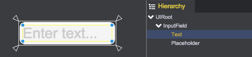

# InputField

The qc.InputField is used to make text editable.

## InputField Composition
Create an InputField object from the main menu(GameObject/Input Field) or toolbar:  

* __InputField__: The qc.InputField object that inherits from [UIImage](UIImage.html), as the backgorund
* __Text__: The [UIText](UIText.html) object, for displaying text content, referenced by inputField.textComponent
* __Placeholder__: The [UIText](UIText.html) object, for displaying tips when text content is empty. referenced by inputField.placeholder

Through the code below you can get the same result as above:
````javascript
var node = new qc.InputField(game, parent);
node.texture = game.assets.find('__builtin_resource__');
node.frame = 'button.png';
node.imageType = qc.UIImage.IMAGE_TYPE_SLICED;
node.textComponent.fontSize = 18;
node.placeholder.fontSize = 18;
````

## InputField Properties

* __Text__: Text content, node.textComponent.text = 'QICI Engine';
* __Placeholder Text__: Tips displayed when text content is empty, node.placeholder.text = 'Enter Text...';
* __State__: The InputField has 3 state described as below:
	* qc.UIState.NORMAL - Normal state
	* qc.UIState.PRESSED - Presssed state
	* qc.UIState.DISABLED - Uneditable state
* __Character Limit__: The maximum number of characters, node.characterLimit = 6;
* __LineType__: Line type of the input field, node.lineType = qc.InputField.SINGLE_LINE;
	* qc.InputField.SINGLE_LINE: Single line
	* qc.InputField.MULTI_LINE: Multi lines, the user can insert line breaks with the enter/return key
* __Content Type__: Type of content, node.contentType = qc.InputField.PASSWORD;
	* qc.InputField.STANDARD: Standard type
	* qc.InputField.INT: Integer type
	* qc.InputField.NUMBER: Floating point type
	* qc.InputField.TEL: Telephone number
	* qc.InputField.EMAIL: EMail address
	* qc.InputField.PASSWORD: Password Type
* __Text Component__: The text object reference
* __Placeholder__: The placeholder object reference

## API
[InputField API](http://docs.qiciengine.com/api/gameobject/CInputField.html)

## Demo
[InputField Demo](http://engine.qiciengine.com/demo/index.html#anchor_InputField)
