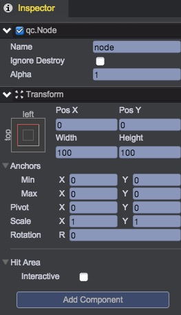

# Node
qc.Node represent empty game object, all other components like UIImage, Sprite, Text, .etc, all inherit from qc.Node. So all the Node's features are applied to all game objects.

Node doesn't render itself, mostly used to organize structure of the hierarchy and add script components.

## Create an empty Node object
There are 4 ways to create an empty Node object:  
### Main Menu: 
  
### Toolbar: 
  
### Context Menu:  
  
### By Code: 
````javascript
// Create an empty node and specified the parent
game.add.node(parent);
````

## Operation of Node in Inspector   
  

### Visible  
Check to make it visible, uncheck to make it hidden. when hidden, it will be rendered as gray in Hierarchy.   
  
````javascript
node.visible = true;
````

### Name  
Set the name for node, don't contain '/' character in name, '/' character has specifical meaning in node.find method.   
  
````javascript
node.name = 'QICI Engine';
````  

### Ignore Destroy  
This property only is valid when the node is direct child of the world node. If checked, then this node will not be destoried when switching scene, see [Loading Screen](../LoadingPrefab/index.html) 
````javascript
node.ignoreDestroy = true;
````

### Alpha  
The transparent value with a range from 0.0 to 1.0, alpha of 0.0 is completely transparent, alpha of 1.0 is completely opaque. The alpha value of node will effect its descendants.
````javascript 
node.alpha = 0.5; 
````

### Transform  
See [Basic Layout](../UI/BasicLayout.html)  

### Hit Area  
If "Interactive" is unchecked, the node can not receive any input event, the event will go through it to its parent; If checked, the input event will be captured by this node.
````javascript 
node.interactive = true;
```` 

By default, the hit area coincides with the rectangle of the node, you can check "Editable" to change the hit area:   
   
  
* None: Can not be hit, node.hitArea = null;
* Fit Target: Default value, the rectangle of the node, node.hitArea = undefined;
* Rectangle: Rectangle area, node.hitArea = new qc.Rectangle(x, y, width, height);
* Ellipse: Ellipse area, node.hitArea = new qc.Ellipse(x, y, width, height);	

<video controls="controls" src="../video/oper_node.mp4"></video>  

### Add Component  
click "Add Component" can select scripts to mount on the node.  

<video controls="controls" src="../video/add_script_to_node.mp4"></video>  

## Node API
[Node API](http://docs.qiciengine.com/api/gameobject/CNode.html)

