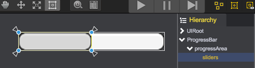
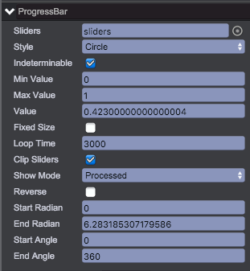

# ProgressBar
* ProgressBar has 2 types：determinable and indeterminable
* ProgressBar has 3 styles: horizontal, vertical and circle  


## ProgressBar Composition
Create ProgressBar object form main menu(GameObject/ProgressBar) or from the ProgressBar button on the toolbar, you will get the result as below:  

* ProgressBar - object of qc.ProgressBar that inherits from [UIImage](UIImage.html), as background image
* progressArea - object of qc.Node, as the area for displaying sliders. By default, it occupies the parent reactangle
* sliders - object of qc.UIImage, as the front image for sliders, referenced by ProgressBar.sliders

Through the code below you can get the same result as above:
````javascript
// Create a progressBar object
var progressBar = new qc.ProgressBar(game, parent);

progressBar.width = 160;
progressBar.height = 20;

// Create progressArea object for displaying sliders
var progressArea = game.add.node(progressBar);
progressArea.name = 'progressArea';
progressArea.setAnchor(new qc.Point(0, 0), new qc.Point(1, 1));
progressArea.setStretch(0, 0, 0, 0);
progressArea.pivotX = progressArea.pivotY = 0.5;

// Create sliders object
var sliders = game.add.image(progressArea);
sliders.name = 'sliders';
sliders.setAnchor(new qc.Point(0, 0), new qc.Point(1, 1));
sliders.setStretch(0, 0, 0, 0);
sliders.pivotX = sliders.pivotY = 0.5;

// that sliders object referenced progressBar
progressBar.sliders = sliders;

// Set background image on progressBar object
progressBar.texture = game.assets.find('__builtin_resource__');
progressBar.frame = 'button.png';
progressBar.imageType = qc.UIImage.IMAGE_TYPE_SLICED;
progressBar.value = 0.5;

// Set front image on sliders
sliders.texture = game.assets.find('__builtin_resource__');
sliders.frame = 'button.png';
sliders.imageType = qc.UIImage.IMAGE_TYPE_SLICED;

// Normally we set sliders's image the same as progressBar, and set the sliders's colorTint for gray effect
sliders.colorTint = new qc.Color('#E0E0E0');
````

## Inspector Panel Settings
		
* __Sliders__: object of UIImage, node.sliders = sliders;
* __Style__: Support 3 styles as below, node.style = ProgressBar.STYLE_HORIZONTAL;
	* __Horizontal ProgressBar__ - ProgressBar.STYLE_HORIZONTAL
	* __Vertical ProgressBar__ - ProgressBar.STYLE_VERTICAL
	* __Circle ProgressBar__ - ProgressBar.STYLE_CIRCLE
* __Indeterminable__: If is indeterminable, sliders will scroll infinitely, node.indeterminable	= true;
* __Min Value__: the min value, node.minValue = 0.0;
* __Max Value__: the max value, node.maxValue = 1.0;
* __Value__: current value, node.value = 0.3;
* __Fixed Size__: The silders's size percentage of the parent rectangle, 1.0 as occupy the whole rectangle, negative value as not fixed size, node.fixedSize = 0.3;
* __Loop Time__: The loop duration in million seconds when as indeterminable, node.loopTime = 3000;
* __Clip Sliders__: Whether to clip silders or not. Normally need to be clipped when as circle style, node.clipSliders = true;
* __Show Mode__: Sliders to be displayed as processed part or remained part, node.showMode = ProgressBar.SHOW_PROCESSED;
	* ProgressBar.SHOW_PROCESSED
	* ProgressBar.SHOW_REMAINED
* __Reverse__: sliders move on the reverse direction, node.reverse = false;
* __Start Radian__: The start radian, valid when circle style, node.startRadian = Math.PI;
* __End Radian__: The end radian, valid when circle style, node.endRadian = Math.PI;
* __Start Angle__: The start angle, valid when circle style, node.startAngle = 90;
* __End Angle__: The start angle, valid when circle style, node.endAngle = 90;

## Sample：	
  
  

## API
[ProgressBar API](http://docs.qiciengine.com/api/gameobject/CProgressBar.html)

## Demo
[ProgressBar Demo](http://engine.qiciengine.com/demo/ProgressBar/progressBar_todo/index.html)
