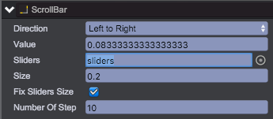
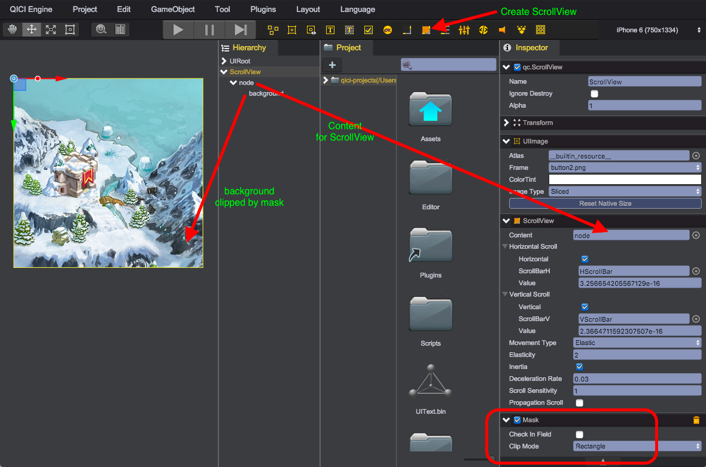

# ScrollBar
The qc.ScrollBar allows the user to scroll an image or other view that is too large to see completely. The ScrollBar is similar to [Slider](Slider.html), normally it will be used with [ScrollView](#scrollView).

## ScrollBar Composition
Create two ScrollBar objects from main menu(GameObject/ScrollBar) or toolbar, one is horizontal, another one is vertical:  
  
* __ScrollBar__ - The qc.ScrollBar object that inherits from [UIImage](UIImage.html)
* __slidingArea__ - The qc.Node object, as the area for displaying sliders. By default, it occupies the parent reactangle
* __sliders__ - The qc.UIImage object, as the front image for sliders, referenced by ScrollBar.sliders

Through the code below you can create a ScrollBar programmly:
````javascript
// Create a ScrollBar object
var scrollBar = new qc.ScrollBar(game, parent);

scrollBar.width = 160;
scrollBar.height = 20;
scrollBar.size = 0.2;
scrollBar.direction = qc.ScrollBar.LEFT_TO_RIGHT;

// Create a node as scroll area
var slidingArea = game.add.node(scrollBar);
slidingArea.name = 'slidingArea';
slidingArea.setAnchor(new qc.Point(0, 0), new qc.Point(1, 1));
slidingArea.setStretch(0, 0, 0, 0);
slidingArea.pivotX = slidingArea.pivotY = 0.5;

// Create an UIImage as the sliders
var sliders = game.add.image(slidingArea);
sliders.name = 'sliders';
sliders.setAnchor(new qc.Point(0, 0), new qc.Point(1, 1));
sliders.setStretch(0, 0, 0, 0);
sliders.pivotX = sliders.pivotY = 0.5;
scrollBar.sliders = sliders;
scrollBar.interactive = true;

scrollBar.texture = game.assets.find('__builtin_resource__');
scrollBar.frame = 'sliderbg.png';
scrollBar.imageType = qc.UIImage.IMAGE_TYPE_SLICED;

sliders.texture = game.assets.find('__builtin_resource__');
sliders.frame = 'button.png';
sliders.imageType = qc.UIImage.IMAGE_TYPE_SLICED;
````

## ScrollBar Properties
  
* __Direction__: Scroll direction, support 4 types as described below, node.direction = qc.ScrollBar.LEFT_TO_RIGHT;
 * qc.ScrollBar.LEFT_TO_RIGHT, horizontal scroll, left is 0.0, right is 1.0
 * qc.ScrollBar.RIGHT_TO_LEFT, horizontal scroll, left is 1.0, right is 0.0
 * qc.ScrollBar.TOP_TO_BOTTOM, vertical scroll, top is 0.0, bottom is 1.0
 * qc.ScrollBar.BOTTOM_TO_TOP, vertical scroll, top is 1.0, bottom is 0.0
* __Value__: Current scroll position value, range from 0.0 to 1.0
* __Sliders__: The sliders object, scrollBar.sliders = sliders;
* __Size__: The silders's size percentage of the parent rectangle, range from 0.0 to 1.0, scrollBar.size = 0.2;
* __Fix Silders Size__: Whether to specify the sliders size, scrollBar.fixSlidersSize = true;
* __Number Of Step__: The steps count for moing from 0.0 to 1.0, scrollBar.numberOfStep = 10;

# ScrollView
The ScrollView can be used when content that takes up a lot of space needs to be displayed in a small area. The ScrollView provides functionality to scroll over this content.

## ScrollView Composition
Create a ScrollView object from main menu(GameObject/ScrollView) or from toolbar, create an UIImage as big image content:

* __ScrollView__ - The qc.ScrollView object inherits from [UIImage](UIImage.html)
* __node__ - The qc.Node object refrenced by scrollView.content as the root node of scroll content
* __background__ - The qc.UIImage object as the big image content for scrolling

Through the code below you can get the same result as above:
````javascript
// Create a ScrollView object
var scrollView = new qc.ScrollView(game, parent);

// Set a gray texture as background
scrollView.texture = game.assets.find('__builtin_resource__');
scrollView.frame = 'button.png';
scrollView.imageType = qc.UIImage.IMAGE_TYPE_SLICED;

// Set scrollView's size
scrollView.width = 400;
scrollView.height = 400;

// Enable horizontal and vertical scrolling
scrollView.canHorizontal = true;
scrollView.canVertical = true;

// Enable interaction
scrollView.interactive = true;

// Set movement type for auto rebound when out of the bounds of content
scrollView.movementType = qc.ScrollView.MOVEMENT_ELASTIC;
// Set the rebound speed, rebound faster with higher value
scrollView.elasticity = 2;

// Set a mask to clip the content to fit into the size of the scrollView
var mask = scrollView.addScript("qc.NodeMask");
mask.checkInField = false;

// Create a node as root node of the content
var content = game.add.node(scrollView);
scrollView.content = content;

// Add an UIImage object with a big image texture as content
var background = game.add.image(content);
background.texture = game.assets.find('backgroundKey');
background.resetNativeSize();

````

## ScrollView Properties

* __Content__: the root node of content, node.content = content;
* __Horizontal Scroll__:
	* Horizontal: Whether ot enable horizontal scrolling, node.canHorizontal = true;
	* ScrollBarH: Reference to the horizontal ScrollBar object, node.horizontalScrollBar = scrollBar;
	* Value: horizontal scroll position, in the range 0.0 to 1.0., node.horizontalNormalizedPosition = 0.5;
* __Vertical Scroll__:
	* Vertical: Whether ot enable vertical scrolling, node.canVertical = true;
	* ScrollBarV: Reference to the vertical ScrollBar object, node.verticalScrollBar = scrollBar;
	* Value: vertical scroll position, in the range 0.0 to 1.0., node.verticalNormalizedPosition = 0.5;
* __Movement Type__: Support 3 types described as below, node.movementType = qc.ScrollView.MOVEMENT_ELASTIC;
	* qc.ScrollView.MOVEMENT_UNRESTRICTED: No scroll limit
	* qc.ScrollView.MOVEMENT_ELASTIC: Auto rebound when out of the bounds of content
	* qc.ScrollView.MOVEMENT_CLAMPED: Limit the scrollable bounds to the content
* __Elasticity__: The rebound speed, rebound faster with higher value, node.elasticity = 2；
* __Inertia__: Whether to enable inertia scrolling, node.inertia = true;
* __DecelerationRate__: Deceleration rate for inertia scrolling, node.decelerationRate = 0.03;
* __ScrollSensitivity__: The scrolling speed, scroll faster with higher value, node.scrollSensitivity = 1;
* __Propagation Scroll__: Whether to propagate the scroll event to the parent, only valid when movementType is MOVEMENT_CLAMPED

## Video
<video controls="controls" src="../video/oper_scrollview.mp4"></video>  

## API
* [ScrollBar API](http://docs.qiciengine.com/api/gameobject/CScrollBar.html)
* [ScrollView API](http://docs.qiciengine.com/api/gameobject/CScrollView.html)

## Demo
[Demo](http://engine.qiciengine.com/demo/ScrollView/scrollView_with_scrollbar/index.html)
