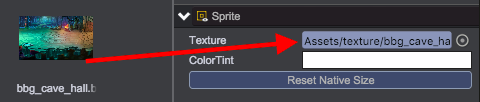
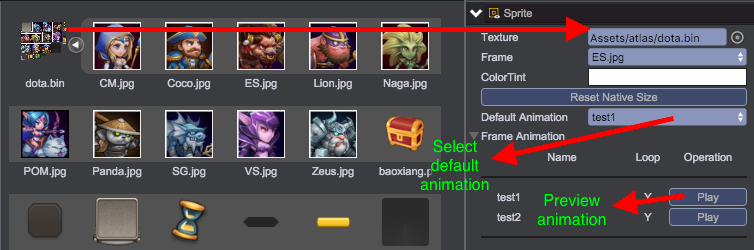

# Sprite
The qc.Sprite can be used to display image like [UIImage](UIImage.html), but more importantly, it is used to dispaly frame-by-frame animation and skeleton animation.

*The Sprite object can not contain any game object as its child*

## Types of Animation
The animationType property determine what kind of animation the sprite is, the property will be set when setting texture. Currently Sprite supports four types of animation:
* Simple Image - qc.Sprite.NONE_ANIMATION
* Frame-by-Frame Animation - qc.Sprite.FRAME_ANIMATION
* Skeleton Animation - qc.Sprite.DRAGON_BONES
* Skeleton Sampled Animation - qc.Sprite.FRAME_SAMPLES

### Simple Image
No animation, the image will be scale to fit the rectangle of the Sprite.  

````javascript
// Set texture asset
node.texture = game.assets.find('textureKey');
````

### Frame-by-Frame Animation
Frame-by-frame animation changes the frame of the sprite with the defined frequence  

````javascript
// Set texture asset
node.texture = game.assets.find('textureKey');
// Set default animation name
node.defaultAnimation = 'test1';
// Play 'test2' animation
node.playAnimation('test2');
// Stop current animation
node.stop();
````

See [Frame Animation](../FrameAnimation/index.html)  


### Skeleton Animation
See [Skeleton Animation](../DragonBone/index.html)  

Making skeleton animation asset is much more complex than frame animation, but it save much more memory than using frame animation when running game. The API to operate skeleton animation is the same with frame animation.

### Skeleton Sampled Animation
Using skeleton sampled animation is the same with using skeleton animation, but you need to click 'Sampled' button in Inspector panel to sample skeleton animation.

Skeleton sampled animation has much better render performance than skeleton animation, but using a bit more memory, we recommand to use skeleton sampled animation.  


## Sprite API
[Sprite API](http://docs.qiciengine.com/api/gameobject/CSprite.html)

## Sprite Demo
[Sprite Demo](http://engine.qiciengine.com/demo/index.html#anchor_Sprite)


