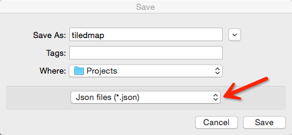
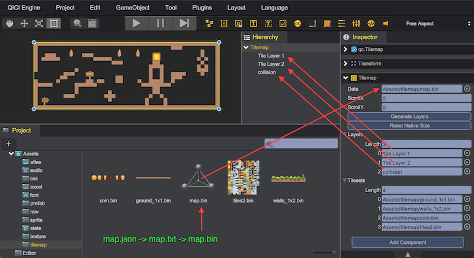
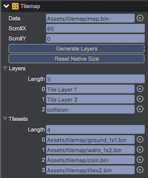

# Tilemap
If you need a big map that is made up of a lot of same and samll images, then you can use qc.Tilemap to display tile-based maps.

## Create Tilemap Assets
qc.Tilemap is compliant with the map files created by [Tiled Map Editor](http://www.mapeditor.org/), "Orientation" is "Orthogonal", "Tile layer format为CSV" is "CSV", and exported as json format.  
  
  
  

## Import Tilemap Assets
Change the exported json file's subffix to .txt, open the file with any text editor, and change all the tilesets's name property to the name of image asset. the image property in tilesets is useless, Tilemap just use the name property to find image asset.
````javascript
 {
// ...
	"tilesets":[
        {
         "firstgid":1,
         "image":"/user/local/tiledmap_src.png",
         "imageheight":64,
         "imagewidth":176,
         "margin":0,
         "name":"tiledmap_src"
         // ...
        }
        // ...
	]
// ...
}
````
* Drag text and related images files to import to project's folder
* Create a Tilemap object from main menu(GameObject/Tilemap) or toolbar's Tilemap button
* Drag the .bin asset generated from .txt file to the Data property of Tilemap object in Inspector panel
* Click "Generate Layers" button to generate qc.TileLayer of qc.ObjectLayer objects as children.



The operations above can be done by code as bleow:
````javascript
var tilemap = game.add.tilemap();
tilemapk.data = game.assets.find('tilemapKey');
tilemap.generateLayers();
tilemap.resetNativeSize();
````

The operations above create a Tilemap object, and three children:
* __Tilemap__ - qc.Tilemap object, for manage sub layers
* __Tile Layer 1__ 和 __Tile Layer 2__ - qc.TileLayer objects, for display layer map
* __collision__ - qc.ObjectLayer object, store the objects information for using

## Tilemap
  
* __Data__ - The Tilemap asset
* __ScrollX__ - Horizontal scroll distance
* __ScrollY__ - Vertical scroll distance
* __Generate Layers__ - Generate sub layers
* __Reset Native Size__ - Set the Tilemap object to the size of the map
* __Layers__ - The Array object of sub layers
* __Tilesets__ - The Array object of image assets

## TileLayer
  
* __Tilemap__ - The corresponding Tilemap object
* __Layer Index__ - The layer index
* __ScrollX Ratio__ - The horizontal scroll ratio, default value is 1
* __ScrollY Ratio__ - The vertical scroll ratio, default value is 1

The map's offset is determine by tileLayer.scrollXRatio * tilemap.scrollX and tileLayer.scrollYRatio * tilemap.scrollY, so the different scroll ratio in layers will have the parallax scrolling effect.
  


## ObjectLayer  

* __Tilemap__ - The corresponding Tilemap object
* __Layer Index__ - The layer index
* __ScrollX Ratio__ - The horizontal scroll ratio, default value is 1
* __ScrollY Ratio__ - The vertical scroll ratio, default value is 1

## video 
<video controls="controls"  src="../video/tilemap.mp4"></video> 

## API
* [Tilemap API](http://docs.qiciengine.com/api/gameobject/CTilemap.html)
* [TileLayer API](http://docs.qiciengine.com/api/gameobject/CTileLayer.html)
* [ObjectLayer API](http://docs.qiciengine.com/api/gameobject/CObjectLayer.html)

## Demo
[Demo](http://engine.qiciengine.com/demo/Tilemap/tilemap_Mario/index.html)
